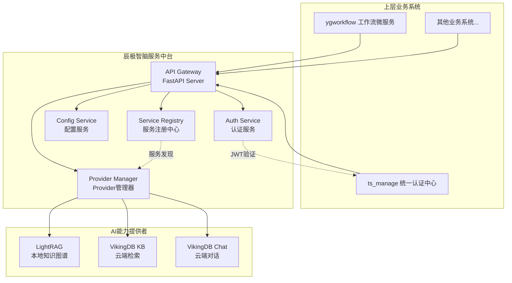
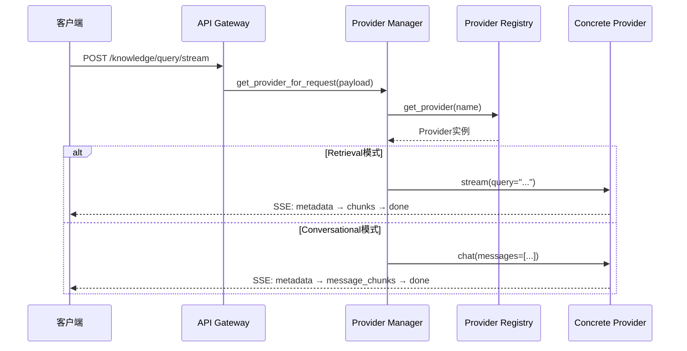
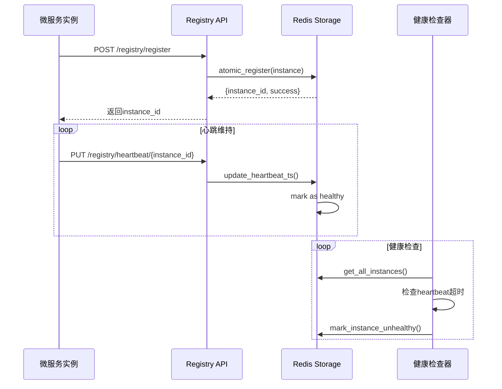

# 辰极智脑服务中台 - 项目概览与核心架构

> **30秒理解本质**: 辰极智脑不是需求管理引擎,而是一个可扩展的公司级AI服务中台。它统一管理和路由所有AI子服务,为上层业务提供稳定、高效、安全的AI能力调用接口。

## 一、项目定位

**辰极智脑服务中台** - 面向未来的企业级AI服务聚合平台,集成服务注册中心、动态路由、多AI能力统一调度于一体。

### 核心价值主张

```
┌──────────────────────────────────────────────────────────────┐
│  上层业务系统 (ygworkflow、ts_manage、...)                      │
│  ↓ 统一API接口调用                                              │
├──────────────────────────────────────────────────────────────┤
│  辰极智脑服务中台                                                │
│  • 服务注册与发现      • 动态路由与负载均衡                      │
│  • 统一认证鉴权        • 双模式查询系统                          │
│  • Provider架构        • 可观测性监控                           │
├──────────────────────────────────────────────────────────────┤
│  AI能力提供者                                                   │
│  • LightRAG (本地知识图谱)                                      │
│  • VikingDB KB (云端检索)                                       │
│  • VikingDB Service/Chat (云端对话)                            │
│  • 未来: 更多AI能力...                                          │
└──────────────────────────────────────────────────────────────┘
```

## 二、核心特性

### 2.1 双模式查询系统

基于Provider类型化架构,支持两种AI交互范式:

- **Retrieval (检索模式)**: 单轮检索,返回相关文档片段
  - Provider: `lightrag`, `vikingdb_kb`
  - 用例: 知识库检索、文档问答
  - 接口: `/api/v1/knowledge/query/stream` (payload: `{retrieval: {query: "..."}})`)

- **Conversational (对话模式)**: 多轮对话,上下文连续
  - Provider: `vikingdb_service_chat`
  - 用例: 智能客服、交互式问答
  - 接口: `/api/v1/knowledge/query/stream` (payload: `{conversational: {messages: [...]}}`)

**统一接口设计** (`src/api/routes/knowledge_routes.py:140-215`):
```python
@router.post("/knowledge/query/stream")
async def query_knowledge_stream(payload: Dict[str, Any], ...):
    """
    单一端点支持双模式:
    - payload.retrieval → 触发检索Provider
    - payload.conversational → 触发对话Provider
    """
    async with mgr as ctx:
        if "retrieval" in payload:
            return ctx.provider.stream(**payload["retrieval"])
        elif "conversational" in payload:
            return ctx.provider.chat(**payload["conversational"])
```

### 2.2 Provider架构

Provider是AI能力的抽象层,所有AI服务必须实现统一接口契约。

**核心抽象** (`src/api/rag_providers/base.py:147-253`):
```python
class BaseProvider(ABC):
    @abstractmethod
    async def stream(self, query: str, **kwargs) -> AsyncIterator[SSEEvent]:
        """检索流式查询"""

    @abstractmethod
    def capabilities(self) -> ProviderCapabilities:
        """能力声明: retrieval/conversational、知识库管理等"""

class ConversationalProvider(BaseProvider):
    @abstractmethod
    async def chat(self, messages: List[ChatMessage], **kwargs) -> AsyncIterator[SSEEvent]:
        """对话流式查询"""
```

**能力声明系统** (`src/api/rag_providers/capabilities.py:17-40`):
```python
LIGHTRAG_CAPABILITIES = ProviderCapabilities(
    provider_type=ProviderType.RETRIEVAL,
    interaction_modes={InteractionMode.SINGLE_TURN},
    knowledge_management=KnowledgeManagement(build=True, delete=True),
    supports_streaming=True
)

VIKINGDB_SERVICE_CHAT_CAPABILITIES = ProviderCapabilities(
    provider_type=ProviderType.CONVERSATIONAL,
    interaction_modes={InteractionMode.MULTI_TURN},
    knowledge_management=KnowledgeManagement(build=False),
    supports_streaming=True
)
```

### 2.3 服务注册中心

基于Redis的SSOT+对称索引模式,实现服务发现和健康管理。

**架构特点** (`src/api/services/service_registry/storage.py:61-70`):
- **SSOT (Single Source of Truth)**: `service_registry:{namespace}:services:{instance_id}`
- **索引系统**:
  - 名称映射: `name_mapping:{service_name} → set(instance_id)`
  - 健康索引: `health:{healthy|unhealthy} → set(instance_id)`
  - 路由索引: `routes:{prefix} → service_name`

**原子注册** (`src/api/services/service_registry/storage.py:79-121`):
```lua
-- Lua脚本保证原子性
local atomic_register = [[
    -- 检查路由冲突
    local existing_service = redis.call('GET', routes_key)
    if existing_service and existing_service ~= service_name then
        return {false, "route_conflict", "..."}
    end

    -- 写入SSOT
    redis.call('HSET', ssot_key, ...)

    -- 更新索引
    redis.call('SADD', name_mapping_key, instance_id)
    redis.call('SET', routes_key, service_name)
    redis.call('SADD', healthy_set_key, instance_id)
]]
```

### 2.4 统一认证系统

集成ts_manage企业统一认证中心,实现SSO与动态权限。

**关键实现**:
- 后端: `src/api/services/ts_manage_auth_service.py`
- 路由保护: `src/api/routes/auth_routes.py`
- 前端Store: `frontendRef/src/stores/auth.ts`
- 路由守卫: `frontendRef/src/router/guards/authGuard.ts`

## 三、技术栈一览

### 后端技术

| 技术 | 版本 | 用途 | 关键文件 |
|------|------|------|----------|
| **FastAPI** | - | 高性能异步Web框架 | `src/api_main.py` |
| **Pydantic** | - | 数据验证与类型安全 | `src/api/services/service_registry/models.py` |
| **Redis** | - | 服务注册存储 | `src/api/services/service_registry/storage.py` |
| **PostgreSQL** | - | 配置持久化 | Phase 4重构(委托模式) |
| **LightRAG** | - | 本地知识图谱引擎 | `src/lightrag_service/` |
| **Uvicorn** | - | ASGI服务器 | `src/api_main.py:125` |

### 前端技术

| 技术 | 版本 | 用途 | 性能指标 |
|------|------|------|----------|
| **Vue 3** | 3.5.18 | Composition API | - |
| **TypeScript** | 5.8 | 类型安全 | 零错误 |
| **Element Plus** | 2.10.6 | 企业级UI组件 | - |
| **Pinia** | 3.0.3 | 状态管理 | - |
| **Vite** | 7.0.6 | 构建工具 | 4.80s生产构建 |
| **Axios** | 1.11.0 | HTTP客户端 | 模块化服务(-78.57% bundle) |

## 四、系统架构图

### 4.1 服务中台总体架构



### 4.2 Provider架构流程



### 4.3 服务注册与发现流程



## 五、关键模块介绍

### 5.1 RAG Provider模块

**路径**: `src/api/rag_providers/`

| 文件 | 职责 | 关键类/函数 |
|------|------|-------------|
| `base.py` | Provider抽象基类 | `BaseProvider`, `ConversationalProvider` |
| `capabilities.py` | 能力声明常量 | `LIGHTRAG_CAPABILITIES`, `VIKINGDB_*_CAPABILITIES` |
| `registry.py` | Provider注册表 | `ProviderRegistry.register()`, `.get()` |
| `registry_manager.py` | 生命周期管理 | `ProviderRegistryManager.initialize()`, `.cleanup()` |

**设计亮点**:
- **类型安全**: `ProviderType`枚举区分retrieval/conversational
- **能力声明**: 运行时查询Provider支持的操作
- **异步上下文**: 使用`async with`管理资源生命周期

### 5.2 Service Registry模块

**路径**: `src/api/services/service_registry/`

| 文件 | 职责 | 行数 | 核心技术 |
|------|------|------|----------|
| `storage.py` | Redis存储层 | 602 | Lua原子脚本 |
| `models.py` | API数据模型 | 136 | Pydantic验证 |
| `health_checker.py` | 健康检查 | - | 异步定时任务 |
| `load_balancer.py` | 负载均衡 | - | 加权轮询 |
| `proxy.py` | HTTP代理转发 | - | httpx异步请求 |

**SSOT索引模式示例** (`storage.py:122-131`):
```python
keys = {
    'ssot': 'service_registry:{namespace}:services:{instance_id}',
    'name_mapping': 'service_registry:{namespace}:name_mapping:{service_name}',
    'health_healthy': 'service_registry:{namespace}:health:healthy',
    'health_unhealthy': 'service_registry:{namespace}:health:unhealthy',
    'routes': 'service_registry:{namespace}:routes:{prefix}'
}
```

### 5.3 Config System模块

**路径**: `src/api/config/` (未在本次调研中发现文件,根据git log Phase 4重构推断)

**Phase 4重构成果** (git log `28ad422`):
- **委托模式**: 服务层重构,511行代码
- **Phase 3**: 实现12个配置加载器,2033行代码
- **Phase 2**: 存储层抽象
- **Phase 1**: 16个Pydantic模型提取

**配置优先级** (根据CLAUDE.md第297行):
```
1. 数据库配置 (PostgreSQL)
2. 环境变量 (.env)
3. 默认值
```

## 六、代码质量标准

根据CLAUDE.md中Linus哲学与实际代码:

### 好品味案例

**1. 消除特殊情况** (`knowledge_routes.py:159-178`):
```python
# 坏: 多个if分支处理不同Provider
if provider_type == "lightrag":
    result = lightrag_provider.query(...)
elif provider_type == "vikingdb":
    result = vikingdb_provider.query(...)

# 好: 统一接口,多态调度
ctx.provider.stream(**payload["retrieval"])  # 所有Provider统一方法
```

**2. 数据结构优先** (`base.py:116-133`):
```python
@dataclass
class ProviderCapabilities:
    provider_type: ProviderType
    interaction_modes: Set[InteractionMode]  # 用Set而非List,语义准确
    knowledge_management: KnowledgeManagement
    supports_streaming: bool

    def to_dict(self) -> Dict[str, Any]:
        return {
            "interaction_modes": [mode.value for mode in sorted(self.interaction_modes)],
            # 确保JSON序列化稳定性
        }
```

### 需要改进的地方

**1. 命名不一致** (`api_main.py:4`):
```python
"""
AI-RME 微服务启动器  # ❌ 文档称"AI-RME",实际是"辰极智脑"
AI Requirements Management Engine  # 过时的定位
"""
# 应改为: 辰极智脑服务中台启动器
```

**2. 紧急修复痕迹** (git log `dbddaee`):
```
commit: "兜底方案，configservice查配置会找数据库，然后找环境变量，合并，但是不好，后续改掉。"
# 临时方案未清理,技术债累积
```

## 七、启动与验证

### 本地开发环境

```bash
# 1. 激活虚拟环境 (必须!)
source ~/miniforge3/bin/activate ai_env_lzy
cd /home/root1/PycharmProjects/ygagentlanggraphLZY

# 2. 启动后端 (端口8540)
python src/api_main.py

# 3. 启动前端 (新终端)
cd frontendRef && npm run dev  # 端口5173

# 4. 验证服务
curl http://localhost:8540/api/v1/health/simple
```

### 多环境支持

| 环境 | 后端端口 | 前端命令 | 前端端口 |
|------|----------|----------|----------|
| **开发** | 8540 | `npm run dev` | 5173 |
| **测试** | 8545 | `npm run dev:test` | 5176 |
| **Docker** | 80 | 自动构建 | 80 |

### 健康检查端点

```bash
# 简单健康检查
GET /api/v1/health/simple

# Provider状态
GET /api/v1/rag/config/status
Authorization: Bearer <token>

# Provider能力查询
GET /api/v1/knowledge/capabilities
Authorization: Bearer <token>

# 服务注册中心统计
GET /api/v1/registry/admin/stats
Authorization: Bearer <admin-api-key>
```

## 八、下一步阅读

- **[配置系统详解](README_02_config.md)** - Phase 4重构成果与配置管理
- **[Provider开发指南](README_03_provider.md)** - 如何实现新的AI能力Provider
- **[服务注册中心使用手册](README_04_registry.md)** - 微服务注册与发现
- **[前端架构文档](frontendRef/CLAUDE.md)** - Vue3+TS模块化服务架构

---

**最后更新**: 2025-01-17
**维护者**: @Zeyu Li
**反馈**: 发现问题请提Issue或参考CLAUDE.md第279行Git提交规范
