# 第六章：部署运维

> **作者**: AI Agent 6
> **文件路径**: `/home/root1/PycharmProjects/ygagentlanggraphLZY/README_06_ops.md`
> **基于实际代码**: `/home/root1/PycharmProjects/ygagentlanggraphLZY/src/api_main.py`、`deployment/docker-compose.yml`、`.env.example`

---

## 6.1 环境准备

### 6.1.1 前置依赖检查

| 组件 | 最低版本 | 推荐版本 | 验证命令 |
|------|---------|---------|----------|
| **Python** | 3.10+ | 3.10 | `python3 --version` |
| **Node.js** | 20.19.0+ | 22.12.0+ | `node --version` |
| **npm** | 8.0+ | 10.0+ | `npm --version` |
| **Docker** | 20.10+ | 24.0+ | `docker --version` |
| **Docker Compose** | 2.0+ | 2.20+ | `docker-compose --version` |
| **MySQL** | 8.0+ | 8.0 | `mysql --version` |
| **Neo4j** | 5.0+ | 5.x | - |
| **Qdrant** | latest | latest | - |

### 6.1.2 ⚠️ 虚拟环境激活（必读！）

**这是最关键的步骤！** 忘记激活虚拟环境会导致依赖错误、模块找不到、服务启动失败等一系列问题。

```bash
# ⚠️ 每次开始工作前必须执行！
# 这两行是必须的！不激活虚拟环境会导致依赖错误！
source ~/miniforge3/bin/activate ai_env_lzy
cd /home/root1/PycharmProjects/ygagentlanggraphLZY
```

**为什么这么重要？**
- 项目使用 `micromamba` 管理 Python 虚拟环境（`ai_env_lzy`）
- 所有依赖（FastAPI、LightRAG、Neo4j驱动等）都安装在虚拟环境中
- 不激活虚拟环境会导致系统 Python 无法找到这些依赖
- 后端启动脚本 `/home/root1/PycharmProjects/ygagentlanggraphLZY/src/api_main.py` 依赖虚拟环境中的包

**如何验证虚拟环境已激活？**
```bash
# 方法1: 查看命令提示符，应该显示 (ai_env_lzy)
(ai_env_lzy) user@hostname:~/PycharmProjects/ygagentlanggraphLZY$

# 方法2: 检查 Python 路径
which python
# 应该输出: /home/root1/miniforge3/envs/ai_env_lzy/bin/python

# 方法3: 验证关键包是否可导入
python -c "import fastapi, lightrag; print('✅ 环境正常')"
```

### 6.1.3 创建虚拟环境（首次安装）

如果尚未创建虚拟环境，使用项目提供的配置文件：

```bash
# 使用 micromamba 创建环境（推荐）
micromamba create -f deployment/environment.yml -n ai_env_lzy

# 或者使用 conda
conda env create -f deployment/environment.yml
```

**环境配置文件**: `/home/root1/PycharmProjects/ygagentlanggraphLZY/deployment/environment.yml`

关键依赖:
- Python 3.10
- FastAPI 0.116.1
- uvicorn + gunicorn
- lightrag-hku 1.4.6
- Neo4j Python Driver
- Qdrant Client
- PyMySQL

---

## 6.2 快速开始 - 5分钟启动完整应用

### 6.2.1 开发环境启动（推荐）

#### 第一步：激活虚拟环境（必须！）
```bash
source ~/miniforge3/bin/activate ai_env_lzy
cd /home/root1/PycharmProjects/ygagentlanggraphLZY
```

#### 第二步：配置环境变量
```bash
# 复制环境变量模板
cp .env.example .env

# 编辑配置文件（必须配置的项目见下方表格）
vim .env  # 或使用 nano/vscode
```

**最小必需配置**（其他配置有默认值）:
```bash
# LLM配置
LLM_API_KEY=sk-or-v1-your-api-key-here

# MySQL配置
MYSQL_PASSWORD=your-mysql-password

# Neo4j配置
NEO4J_PASSWORD=your-neo4j-password
```

#### 第三步：启动后端服务
```bash
# 确保虚拟环境已激活（查看命令提示符是否有 (ai_env_lzy)）
python src/api_main.py

# 或指定端口
python src/api_main.py --api-port 8540
```

**启动脚本**: `/home/root1/PycharmProjects/ygagentlanggraphLZY/src/api_main.py`

**预期输出**:
```
🚀 启动 AI-RME 微服务
🌐 服务器 IP: 192.168.11.32
🔧 启动模式: AI-RME REST API 服务
📋 初始化配置服务...
✅ 配置服务初始化成功
📡 LightRAG API 服务地址: http://0.0.0.0:8540
📚 API 文档: http://0.0.0.0:8540/docs
```

#### 第四步：启动前端（新终端）
```bash
# 不需要激活虚拟环境（前端是Node.js项目）
cd frontendRef

# 首次启动需要安装依赖
npm install

# 启动开发服务器
npm run dev
```

**前端配置文件**: `/home/root1/PycharmProjects/ygagentlanggraphLZY/frontendRef/.env.development`

**预期输出**:
```
  VITE v7.0.6  ready in 1234 ms

  ➜  Local:   http://localhost:5173/
  ➜  Network: http://192.168.11.32:5173/
```

#### 第五步：验证服务
```bash
# 后端健康检查
curl http://localhost:8540/api/v1/health/simple

# 预期响应
{
  "status": "ok",
  "timestamp": 1729234567.890,
  "service": "LightRAG REST API"
}
```

打开浏览器访问:
- **前端应用**: http://localhost:5173
- **后端API文档**: http://localhost:8540/docs
- **健康检查**: http://localhost:8540/api/v1/health/simple

### 6.2.2 完整启动脚本（一键启动）

创建启动脚本 `start.sh`:
```bash
#!/bin/bash

# 颜色输出
GREEN='\033[0;32m'
RED='\033[0;31m'
NC='\033[0m' # No Color

echo -e "${GREEN}========================================${NC}"
echo -e "${GREEN}  辰极智脑服务中台 - 一键启动脚本  ${NC}"
echo -e "${GREEN}========================================${NC}"

# 步骤1: 检查虚拟环境
echo -e "\n${GREEN}[1/5] 检查虚拟环境...${NC}"
if [[ "$CONDA_DEFAULT_ENV" != "ai_env_lzy" ]]; then
    echo -e "${RED}❌ 虚拟环境未激活！${NC}"
    echo -e "${RED}请先执行: source ~/miniforge3/bin/activate ai_env_lzy${NC}"
    exit 1
fi
echo -e "${GREEN}✅ 虚拟环境已激活 (ai_env_lzy)${NC}"

# 步骤2: 检查配置文件
echo -e "\n${GREEN}[2/5] 检查配置文件...${NC}"
if [ ! -f .env ]; then
    echo -e "${RED}❌ 配置文件不存在！${NC}"
    echo -e "${RED}请先执行: cp .env.example .env 并编辑配置${NC}"
    exit 1
fi
echo -e "${GREEN}✅ 配置文件存在${NC}"

# 步骤3: 启动后端（后台运行）
echo -e "\n${GREEN}[3/5] 启动后端服务...${NC}"
python src/api_main.py > logs/backend.log 2>&1 &
BACKEND_PID=$!
echo -e "${GREEN}✅ 后端服务已启动 (PID: $BACKEND_PID)${NC}"

# 步骤4: 等待后端就绪
echo -e "\n${GREEN}[4/5] 等待后端就绪...${NC}"
for i in {1..30}; do
    if curl -s http://localhost:8540/api/v1/health/simple > /dev/null 2>&1; then
        echo -e "${GREEN}✅ 后端服务就绪！${NC}"
        break
    fi
    echo -n "."
    sleep 1
    if [ $i -eq 30 ]; then
        echo -e "\n${RED}❌ 后端启动超时！${NC}"
        exit 1
    fi
done

# 步骤5: 启动前端
echo -e "\n${GREEN}[5/5] 启动前端服务...${NC}"
cd frontendRef
npm run dev > ../logs/frontend.log 2>&1 &
FRONTEND_PID=$!
cd ..
echo -e "${GREEN}✅ 前端服务已启动 (PID: $FRONTEND_PID)${NC}"

# 输出访问地址
echo -e "\n${GREEN}========================================${NC}"
echo -e "${GREEN}  🎉 启动完成！${NC}"
echo -e "${GREEN}========================================${NC}"
echo -e "${GREEN}  前端应用: http://localhost:5173${NC}"
echo -e "${GREEN}  后端API:  http://localhost:8540/docs${NC}"
echo -e "${GREEN}  健康检查: http://localhost:8540/api/v1/health/simple${NC}"
echo -e "${GREEN}========================================${NC}"
echo -e "${GREEN}  停止服务: kill $BACKEND_PID $FRONTEND_PID${NC}"
echo -e "${GREEN}========================================${NC}"
```

使用方法:
```bash
chmod +x start.sh
source ~/miniforge3/bin/activate ai_env_lzy
./start.sh
```

---

## 6.3 环境变量配置详解

### 6.3.1 配置文件位置
- **模板文件**: `/home/root1/PycharmProjects/ygagentlanggraphLZY/.env.example`
- **实际配置**: `/home/root1/PycharmProjects/ygagentlanggraphLZY/.env` （需手动创建）
- **Docker配置**: `/home/root1/PycharmProjects/ygagentlanggraphLZY/.env.docker`

### 6.3.2 配置优先级（Phase 4 重构架构）
```
环境变量 (ENV) > 数据库 (DB) > 代码默认值 (Default)
```

- **环境变量 (ENV)**: 最高优先级，敏感信息推荐使用，修改需重启服务
- **数据库 (DB)**: 次优先级，支持热更新，通过管理界面修改
- **代码默认值 (Default)**: 兜底配置，保证系统最小可用

### 6.3.3 核心配置分组

#### 1. LLM配置（大语言模型）
```bash
# Provider类型: openrouter | openai | anthropic | kimi | gemini
LLM_PROVIDER=openrouter
LLM_MODEL_NAME=deepseek/deepseek-chat-v3-0324
LLM_BASE_URL=https://openrouter.ai/api/v1
LLM_API_KEY=sk-or-v1-your-openrouter-api-key-here  # ⚠️ 必需
LLM_TIMEOUT=120
LLM_TEMPERATURE=0.1
LLM_MAX_TOKENS=8192
LLM_CONTEXT_WINDOW=128000
```

**说明**:
- `LLM_API_KEY`: 必需配置，获取位置取决于 Provider
- `LLM_PROVIDER`: 支持多种Provider，推荐 OpenRouter（支持多模型切换）
- 兼容旧版本别名: `OPENAI_API_KEY`、`OPENROUTER_API_KEY`

#### 2. Embedding配置（向量嵌入）
```bash
# 模式: local (本地模型) | api (API服务)
EMBEDDING_MODE=local

# 本地模式配置
EMBEDDING_MODEL_PATH=/home/root1/localai/Qwen3-Embedding-4B
EMBEDDING_MODEL_NAME=Qwen3-Embedding-4B
EMBEDDING_DIMENSION=2560
EMBEDDING_BATCH_SIZE=32
EMBEDDING_MAX_LENGTH=512
# EMBEDDING_DEVICE=cuda  # 可选: cuda | cpu | null(auto)
```

**说明**:
- `local` 模式: 使用本地模型，需要GPU加速，性能更好
- `api` 模式: 调用远程API，配置 `EMBEDDING_API_*` 变量

#### 3. 存储配置（数据库与缓存）
```bash
# MySQL配置服务数据库
MYSQL_HOST=127.0.0.1
MYSQL_PORT=3306
MYSQL_USER=python
MYSQL_PASSWORD=your-mysql-password  # ⚠️ 必需
MYSQL_DATABASE=ai_service
MYSQL_CHARSET=utf8mb4

# Neo4j图数据库
NEO4J_URI=bolt://localhost:7687
NEO4J_USERNAME=neo4j
NEO4J_PASSWORD=your-neo4j-password  # ⚠️ 必需
NEO4J_DATABASE=neo4j

# Qdrant向量数据库
QDRANT_URL=http://localhost:6333
QDRANT_API_KEY=your-qdrant-api-key

# Redis缓存
REDIS_HOST=localhost
REDIS_PORT=6379
REDIS_PASSWORD=
REDIS_DB=0
```

**说明**:
- MySQL: 存储配置、用户数据、审计日志
- Neo4j: 知识图谱存储（LightRAG核心）
- Qdrant: 向量索引存储（检索加速）
- Redis: 缓存、会话管理（可选）

#### 4. RAG Provider配置
```bash
# Provider类型: lightrag (本地) | vikingdb_kb (云端检索) | vikingdb_service_chat (云端对话)
RAG_PROVIDER=lightrag

# LightRAG配置
LIGHTRAG_TOP_K=10
LIGHTRAG_GRAPH_STORAGE=Neo4JStorage
LIGHTRAG_VECTOR_STORAGE=QdrantVectorDBStorage
LIGHTRAG_KV_STORAGE=JsonKVStorage
```

**说明**:
- `lightrag`: 本地RAG，完全自主可控，需要Neo4j+Qdrant
- `vikingdb_kb`: 火山引擎知识库服务，云端托管
- `vikingdb_service_chat`: 火山引擎对话服务，无需本地存储

#### 5. ts_manage认证集成
```bash
TS_MANAGE_BASE_URL=http://localhost:8760
TS_MANAGE_PLATFORM=aiService
TS_MANAGE_DES_KEY=12345678
TS_MANAGE_TIMEOUT=30
TS_MANAGE_ENABLE_DEV_FALLBACK=false  # 生产环境务必设为 false
```

**说明**:
- ts_manage: 企业级SSO认证系统
- `TS_MANAGE_PLATFORM`: 平台标识，与ts_manage配置一致
- `TS_MANAGE_DES_KEY`: DES加密密钥，与ts_manage共享

#### 6. 服务注册中心配置
```bash
# API密钥列表（逗号分隔）
SERVICE_REGISTRY_API_KEYS=yg-compliance-workflow-service,dev-key,admin-key
SERVICE_REGISTRY_NAMESPACE=Development

# 健康检查配置
HEALTH_CHECK_INTERVAL=30
HEALTH_CHECK_TIMEOUT=5
MAX_CONSECUTIVE_FAILURES=3

# 负载均衡策略: round_robin | weighted_round_robin | swrr
# LOAD_BALANCER_STRATEGY=swrr
```

**说明**:
- 支持服务注册与发现（微服务架构）
- `SERVICE_REGISTRY_API_KEYS`: 用于服务级API认证

#### 7. 服务器配置
```bash
API_PORT=8540
API_HOST=0.0.0.0
LOG_LEVEL=INFO  # DEBUG | INFO | WARNING | ERROR | CRITICAL
DEBUG=false
API_TASK_TIMEOUT=3000  # 毫秒
```

#### 8. JWT认证配置
```bash
JWT_KEY=SecretKey012345678901234567890123456789012345678901234567890123456789
JWT_ALGORITHM=HS256
```

**说明**: 与 ts_manage 共享，用于管理接口认证

### 6.3.4 配置验证命令
```bash
# 启动服务后验证配置加载
python src/api_main.py

# 查看日志输出（应显示"从环境变量加载配置"）
tail -f ai_microservice.log | grep "环境变量"

# API验证
curl http://localhost:8540/api/v1/config/llm
curl http://localhost:8540/api/v1/config/embedding
curl http://localhost:8540/api/v1/config/storage
```

---

## 6.4 Docker部署

### 6.4.1 Docker Compose一键启动

**配置文件**: `/home/root1/PycharmProjects/ygagentlanggraphLZY/deployment/docker-compose.yml`

#### 启动完整栈
```bash
# 复制Docker环境变量模板
cp .env.example .env.docker

# 编辑Docker配置（必须配置 LLM_API_KEY）
vim .env.docker

# 启动所有服务（后端+前端+MySQL+Neo4j+Qdrant+MinIO）
docker-compose -f deployment/docker-compose.yml up -d

# 查看服务状态
docker-compose -f deployment/docker-compose.yml ps

# 查看日志
docker-compose -f deployment/docker-compose.yml logs -f backend
```

#### 服务端口映射
| 服务 | 容器端口 | 宿主机端口 | 环境变量 |
|------|---------|-----------|---------|
| 后端API | 8540 | 8542 | `API_PORT` |
| 前端 | 80 | 81 | `FRONTEND_PORT` |
| MySQL | 3306 | 3306 | - |
| Neo4j HTTP | 7474 | 7477 | `NEO4J_HTTP_PORT` |
| Neo4j Bolt | 7687 | 7689 | `NEO4J_BOLT_PORT` |
| Qdrant | 6333 | 6335 | `QDRANT_PORT` |
| MinIO API | 9000 | 9002 | `MINIO_API_PORT` |
| MinIO Console | 9001 | 9003 | `MINIO_CONSOLE_PORT` |

#### 健康检查验证
```bash
# 后端健康检查（等待2分钟启动）
curl http://localhost:8542/api/v1/health/simple

# Neo4j健康检查
docker exec ygagent-neo4j cypher-shell -u neo4j -p password 'RETURN 1'

# MySQL健康检查
docker exec ygagent-mysql mysql -uroot -pyour_root_password -e 'SELECT 1'

# 查看容器健康状态
docker ps --format "table {{.Names}}\t{{.Status}}"
```

### 6.4.2 Docker服务管理

```bash
# 停止所有服务
docker-compose -f deployment/docker-compose.yml down

# 停止并删除数据卷（清空数据）
docker-compose -f deployment/docker-compose.yml down -v

# 重启服务
docker-compose -f deployment/docker-compose.yml restart backend

# 仅启动后端服务
docker-compose -f deployment/docker-compose.yml up -d backend

# 查看服务日志（实时滚动）
docker-compose -f deployment/docker-compose.yml logs -f --tail=100 backend

# 进入容器调试
docker exec -it ygagent-backend /bin/bash
```

### 6.4.3 后端镜像构建

**Dockerfile**: `/home/root1/PycharmProjects/ygagentlanggraphLZY/deployment/backend.Dockerfile`

使用多阶段构建优化镜像大小:
```bash
# 手动构建镜像
docker build -f deployment/backend.Dockerfile -t ygagent-backend:latest .

# 查看镜像大小
docker images ygagent-backend

# 测试单独运行后端容器
docker run -d \
  --name ygagent-backend-test \
  -p 8540:8540 \
  -e API_HOST=0.0.0.0 \
  -e API_PORT=8540 \
  -e OPENAI_API_KEY=sk-xxx \
  ygagent-backend:latest
```

**镜像特性**:
- 基础镜像: `mambaorg/micromamba:1.5.8`
- 使用清华TUNA镜像加速（Conda + PyPI）
- 多阶段构建减小镜像体积
- 非root用户运行（`mambauser`）

### 6.4.4 数据持久化

Docker Compose自动创建的持久卷:
```bash
# 查看所有数据卷
docker volume ls | grep ygagent

# 数据卷列表
ygagent_rag_storage      # LightRAG知识库数据
ygagent_logs             # 应用日志
ygagent_mysql_data       # MySQL数据库
ygagent_minio_data       # MinIO对象存储
ygagent_neo4j_data       # Neo4j图数据库
ygagent_qdrant_data      # Qdrant向量索引

# 备份数据卷
docker run --rm -v ygagent_neo4j_data:/data -v $(pwd):/backup \
  busybox tar czf /backup/neo4j_backup.tar.gz /data

# 恢复数据卷
docker run --rm -v ygagent_neo4j_data:/data -v $(pwd):/backup \
  busybox tar xzf /backup/neo4j_backup.tar.gz -C /
```

---

## 6.5 多环境支持

### 6.5.1 环境对照表

| 环境 | 后端启动 | 前端启动 | 后端端口 | 前端端口 | 用途 |
|------|---------|---------|---------|---------|------|
| **开发 (dev)** | `python src/api_main.py` | `npm run dev` | 8540 | 5173 | 本地开发调试 |
| **测试 (test)** | `python src/api_main.py --api-port 8545` | `npm run dev:test` | 8545 | 5176 | 测试环境隔离 |
| **生产 (prod)** | `docker-compose up -d` | 自动构建 | 8542 | 81 | Docker部署 |

### 6.5.2 前端环境配置

**文件路径**: `/home/root1/PycharmProjects/ygagentlanggraphLZY/frontendRef/`

```bash
# 开发环境 (.env.development)
VITE_APP_TITLE=辰极智脑
VITE_APP_VERSION=1.0.0
# 自动检测后端地址（localhost:8540）

# 测试环境 (.env.test)
VITE_APP_TITLE=辰极智脑-测试
VITE_APP_VERSION=1.0.0-test
# 自动检测后端地址（localhost:8545）

# 生产环境 (.env.production)
VITE_APP_TITLE=辰极智脑
VITE_APP_VERSION=1.0.0
# 使用Docker反向代理
```

**前端启动命令**:
```bash
cd frontendRef

# 开发环境（连接 localhost:8540）
npm run dev

# 测试环境（连接 localhost:8545）
npm run dev:test

# 生产构建
npm run build

# 预览生产构建
npm run preview
```

### 6.5.3 多环境切换流程

#### 开发环境 → 测试环境
```bash
# 终端1: 启动测试后端（不同端口）
source ~/miniforge3/bin/activate ai_env_lzy
python src/api_main.py --api-port 8545

# 终端2: 启动测试前端
cd frontendRef
npm run dev:test

# 访问 http://localhost:5176
```

#### 测试环境 → 生产环境
```bash
# 1. 配置Docker环境变量
cp .env.example .env.docker
vim .env.docker  # 修改生产配置

# 2. 启动Docker完整栈
docker-compose -f deployment/docker-compose.yml up -d

# 3. 验证服务
curl http://localhost:8542/api/v1/health/simple

# 4. 访问 http://localhost:81
```

---

## 6.6 常见问题排查

### 6.6.1 依赖错误

#### 问题1: `ModuleNotFoundError: No module named 'fastapi'`
**原因**: 虚拟环境未激活

**解决方案**:
```bash
# 检查当前环境
echo $CONDA_DEFAULT_ENV

# 如果不是 ai_env_lzy，重新激活
source ~/miniforge3/bin/activate ai_env_lzy

# 验证Python路径
which python
# 应输出: /home/root1/miniforge3/envs/ai_env_lzy/bin/python

# 验证包安装
python -c "import fastapi; print(fastapi.__version__)"
```

#### 问题2: `lightrag-hku` 版本不匹配
**原因**: 安装了错误的 lightrag 版本

**解决方案**:
```bash
# 激活虚拟环境
source ~/miniforge3/bin/activate ai_env_lzy

# 卸载所有 lightrag 变体
pip uninstall lightrag lightrag-hku -y

# 重新安装指定版本
pip install lightrag-hku==1.4.6

# 验证安装
python -c "import lightrag; print(lightrag.__version__)"
```

### 6.6.2 端口占用

#### 问题: `Address already in use: 8540`
**原因**: 端口被其他进程占用

**解决方案**:
```bash
# 查找占用进程
lsof -i :8540
# 或
netstat -tunlp | grep 8540

# 杀死进程
kill -9 <PID>

# 或使用不同端口启动
python src/api_main.py --api-port 8541
```

#### 常见端口冲突
| 端口 | 服务 | 替代端口 |
|------|------|---------|
| 8540 | 后端API | 8541, 8542 |
| 5173 | 前端Vite | 5174, 5175 |
| 7687 | Neo4j Bolt | 7688 |
| 6333 | Qdrant | 6334 |

### 6.6.3 连接失败

#### 问题: 前端无法连接后端
**原因**: CORS配置、网络防火墙、后端未启动

**排查步骤**:
```bash
# 1. 验证后端是否运行
curl http://localhost:8540/api/v1/health/simple

# 2. 检查后端日志
tail -f ai_microservice.log

# 3. 测试API端点
curl -X GET http://localhost:8540/docs

# 4. 检查前端配置
cat frontendRef/.env.development

# 5. 查看浏览器控制台错误
# F12 → Console → 查看CORS错误
```

**CORS错误解决**: 后端自动配置CORS，无需修改。如有问题，检查 `src/api/server.py`:
```python
# 确认 CORSMiddleware 配置
app.add_middleware(
    CORSMiddleware,
    allow_origins=["*"],  # 开发环境
    allow_credentials=True,
    allow_methods=["*"],
    allow_headers=["*"],
)
```

#### 问题: 无法连接数据库
**排查步骤**:
```bash
# MySQL连接测试
mysql -h 127.0.0.1 -P 3306 -u python -p ai_service

# Neo4j连接测试
cypher-shell -a bolt://localhost:7687 -u neo4j -p password

# Qdrant连接测试
curl http://localhost:6333/collections

# 查看Docker容器日志
docker logs ygagent-mysql
docker logs ygagent-neo4j
docker logs ygagent-qdrant
```

### 6.6.4 性能问题

#### 问题: 启动缓慢
**原因**: 模型加载、依赖初始化

**优化方案**:
```bash
# 1. 使用本地模型缓存
export TRANSFORMERS_CACHE=/path/to/cache

# 2. 禁用不必要的检查
export SKIP_MODEL_VALIDATION=true

# 3. 使用生产模式启动（关闭reload）
uvicorn src.api.server:create_app --host 0.0.0.0 --port 8540 --workers 4
```

#### 问题: API响应慢
**排查步骤**:
```bash
# 1. 查看系统资源
htop  # 或 top

# 2. 检查数据库性能
docker stats ygagent-mysql ygagent-neo4j

# 3. 启用详细日志
export LOG_LEVEL=DEBUG
python src/api_main.py

# 4. 使用性能分析工具
pip install py-spy
py-spy top -- python src/api_main.py
```

---

## 6.7 代码质量工具

### 6.7.1 Mypy 类型检查

**配置文件**: `/home/root1/PycharmProjects/ygagentlanggraphLZY/mypy.ini`

```bash
# 激活虚拟环境
source ~/miniforge3/bin/activate ai_env_lzy

# 运行类型检查
mypy src

# 检查特定模块
mypy src/api/routes/

# 忽略缺失的导入（快速检查）
mypy --ignore-missing-imports src
```

**mypy.ini 配置**:
```ini
[mypy]
files = src
python_version = 3.10
ignore_missing_imports = True
warn_unused_ignores = True
warn_redundant_casts = True
warn_no_return = True
warn_unreachable = True
```

### 6.7.2 Ruff 代码检查

项目计划使用 Ruff 进行代码检查（目前配置文件待创建）

```bash
# 安装 Ruff
pip install ruff

# 检查代码
ruff check src

# 自动修复
ruff check --fix src

# 格式化代码
ruff format src
```

**推荐配置** (`ruff.toml`):
```toml
[tool.ruff]
line-length = 120
target-version = "py310"

[tool.ruff.lint]
select = ["E", "F", "W", "C90", "I", "N", "UP", "B", "A", "C4", "T20"]
ignore = ["E501"]  # 行长度由 formatter 处理

[tool.ruff.lint.per-file-ignores]
"__init__.py" = ["F401"]  # 允许未使用的导入
```

### 6.7.3 Pytest 单元测试

**测试目录**: `/home/root1/PycharmProjects/ygagentlanggraphLZY/tests/`

```bash
# 激活虚拟环境
source ~/miniforge3/bin/activate ai_env_lzy

# 运行所有测试
pytest tests/

# 运行特定测试文件
pytest tests/api/test_auth_routes.py

# 运行特定测试函数
pytest tests/api/test_auth_routes.py::test_login

# 详细输出
pytest -v tests/

# 测试覆盖率报告
pytest --cov=src --cov-report=html tests/

# 只运行失败的测试
pytest --lf

# 并行运行测试
pytest -n 4 tests/
```

**关键测试模块**:
- `tests/api/config/` - 配置系统测试（Phase 4重构）
- `tests/api/test_auth_*.py` - 认证系统测试
- `tests/api/test_*_provider.py` - RAG Provider测试
- `tests/test_complete_workflow.py` - 端到端测试

---

## 6.8 故障排查与监控

### 6.8.1 健康检查端点

**文件路径**: `/home/root1/PycharmProjects/ygagentlanggraphLZY/src/api/routes/health_routes.py`

#### 简单健康检查
```bash
curl http://localhost:8540/api/v1/health/simple
```
**响应**:
```json
{
  "status": "ok",
  "timestamp": 1729234567.890,
  "service": "LightRAG REST API"
}
```

#### 详细健康检查
```bash
curl http://localhost:8540/api/v1/health/detailed
```
**响应内容**:
- 系统平台信息
- Python版本
- CPU/内存/磁盘总量
- 依赖服务状态（task_manager, filesystem, lightrag）
- 性能指标（请求数、响应时间、资源使用率）

#### 系统综合健康检查
```bash
curl http://localhost:8540/api/v1/health/system
```
**响应内容**:
- 资源使用详情（CPU、内存、磁盘、网络、GPU）
- 当前指标（usage percentages）
- 监控状态（进程数、运行时间）
- 统计信息（文档数、查询数、API调用数）
- 服务状态（所有微服务的健康状况）

#### Provider健康检查
```bash
curl http://localhost:8540/api/v1/health/provider
```
**响应内容**:
- Provider类型（lightrag/vikingdb_kb/vikingdb_service_chat）
- Provider能力（retrieval/conversational）
- 降级状态（fallback count）
- 健康检查结果

### 6.8.2 日志查看

#### 后端日志
```bash
# 实时查看日志
tail -f ai_microservice.log

# 过滤错误日志
grep -i error ai_microservice.log | tail -20

# 查看特定模块日志
grep "lightrag" ai_microservice.log | tail -20

# 按时间段查询
grep "2025-10-17 10:" ai_microservice.log
```

#### Docker日志
```bash
# 后端容器日志
docker logs -f ygagent-backend

# 查看最近100行
docker logs --tail=100 ygagent-backend

# 数据库日志
docker logs ygagent-mysql
docker logs ygagent-neo4j
docker logs ygagent-qdrant
```

#### 前端日志（开发模式）
```bash
# 前端开发服务器输出在终端
cd frontendRef
npm run dev

# 浏览器控制台日志
# F12 → Console
```

### 6.8.3 性能监控

#### 系统资源监控
```bash
# CPU/内存/磁盘实时监控
htop

# 详细进程信息
top -p $(pgrep -f api_main.py)

# 磁盘IO
iotop

# 网络连接
netstat -tunlp | grep -E '8540|3306|7687|6333'
```

#### API性能监控
```bash
# 使用 Apache Bench 测试
ab -n 1000 -c 10 http://localhost:8540/api/v1/health/simple

# 使用 wrk 压测
wrk -t 4 -c 100 -d 30s http://localhost:8540/api/v1/health/simple

# 查看API响应时间
curl -w "@curl-format.txt" -o /dev/null -s http://localhost:8540/api/v1/health/simple
```

**curl-format.txt**:
```
    time_namelookup:  %{time_namelookup}\n
       time_connect:  %{time_connect}\n
    time_appconnect:  %{time_appconnect}\n
   time_pretransfer:  %{time_pretransfer}\n
      time_redirect:  %{time_redirect}\n
 time_starttransfer:  %{time_starttransfer}\n
                    ----------\n
         time_total:  %{time_total}\n
```

#### GPU监控（如果使用）
```bash
# NVIDIA GPU监控
nvidia-smi

# 实时监控
watch -n 1 nvidia-smi

# GPU进程监控
nvidia-smi pmon -c 1
```

### 6.8.4 故障排查流程图

```mermaid
graph TD
    A[服务无法访问] --> B{后端健康检查}
    B -->|失败| C[检查后端日志]
    B -->|成功| D{前端能否访问}

    C --> E{虚拟环境激活?}
    E -->|否| F[激活虚拟环境重启]
    E -->|是| G{依赖完整?}

    G -->|否| H[重新安装依赖]
    G -->|是| I{配置正确?}

    I -->|否| J[修复.env配置]
    I -->|是| K{数据库连接?}

    K -->|失败| L[检查MySQL/Neo4j/Qdrant]
    K -->|成功| M[查看详细错误日志]

    D -->|失败| N[检查CORS配置]
    D -->|成功| O[查看浏览器控制台]

    F --> P[重新测试]
    H --> P
    J --> P
    L --> P
    M --> Q[联系开发团队]
    N --> P
    O --> Q

    style A fill:#ff6b6b
    style P fill:#51cf66
    style Q fill:#ffd43b
```



### 6.8.5 常见错误码

| 状态码 | 含义 | 可能原因 | 解决方案 |
|-------|------|---------|---------|
| **500** | 内部服务器错误 | 未捕获的异常、配置错误 | 查看后端日志，修复代码错误 |
| **503** | 服务不可用 | 数据库连接失败、依赖服务宕机 | 检查MySQL/Neo4j/Qdrant状态 |
| **401** | 未授权 | Token无效、未登录 | 重新登录ts_manage获取Token |
| **403** | 禁止访问 | 权限不足 | 检查用户角色和权限配置 |
| **404** | 未找到 | 路由不存在、Provider未配置 | 检查API路径和Provider配置 |
| **422** | 请求参数错误 | Pydantic验证失败 | 检查请求参数格式 |
| **429** | 请求过多 | 触发限流 | 降低请求频率，检查rate limit |

---

## 6.9 部署检查清单

### 6.9.1 生产环境部署前检查

#### 环境准备
- [ ] Python 3.10 虚拟环境已创建并激活
- [ ] Node.js 20.19.0+ 已安装
- [ ] Docker 20.10+ 和 Docker Compose 2.0+ 已安装
- [ ] MySQL 8.0、Neo4j 5.x、Qdrant已安装或Docker容器已启动

#### 配置文件
- [ ] `.env` 文件已创建（从 `.env.example` 复制）
- [ ] `LLM_API_KEY` 已配置
- [ ] `MYSQL_PASSWORD` 已修改为强密码
- [ ] `NEO4J_PASSWORD` 已修改为强密码
- [ ] `JWT_KEY` 已修改为64字符随机字符串
- [ ] `TS_MANAGE_ENABLE_DEV_FALLBACK` 已设置为 `false`
- [ ] `DEBUG` 已设置为 `false`
- [ ] `LOG_LEVEL` 已设置为 `INFO` 或 `WARNING`

#### 安全配置
- [ ] 数据库密码足够强（建议16+字符）
- [ ] API密钥未硬编码在代码中
- [ ] `.env` 文件已添加到 `.gitignore`
- [ ] 防火墙规则已配置（仅开放必要端口）
- [ ] HTTPS证书已配置（生产环境）
- [ ] CORS配置已限制为特定域名（不使用 `*`）

#### 依赖安装
- [ ] 后端依赖已安装: `micromamba run -n ai_env_lzy pip list`
- [ ] 前端依赖已安装: `cd frontendRef && npm ci`
- [ ] 本地模型已下载（如果使用 `EMBEDDING_MODE=local`）

#### 服务验证
- [ ] 后端健康检查通过: `curl http://localhost:8540/api/v1/health/simple`
- [ ] 前端可访问: http://localhost:5173
- [ ] MySQL连接正常: `mysql -h 127.0.0.1 -u python -p ai_service -e 'SELECT 1'`
- [ ] Neo4j连接正常: `cypher-shell -a bolt://localhost:7687 -u neo4j -p password 'RETURN 1'`
- [ ] Qdrant连接正常: `curl http://localhost:6333/collections`

#### 性能测试
- [ ] API响应时间 < 200ms (健康检查端点)
- [ ] 并发100用户压测通过
- [ ] 内存占用在可接受范围（后端 < 2GB）
- [ ] CPU使用率 < 80%

#### 监控告警
- [ ] 日志轮转已配置（避免日志文件过大）
- [ ] 错误日志监控已启用
- [ ] 磁盘空间监控已启用（剩余 < 20% 告警）
- [ ] 数据库备份计划已配置

#### 文档准备
- [ ] 部署文档已更新（本文档）
- [ ] API文档可访问: http://localhost:8540/docs
- [ ] 运维手册已准备
- [ ] 回滚方案已制定

### 6.9.2 Docker部署检查清单

- [ ] `.env.docker` 文件已配置
- [ ] Docker镜像已构建: `docker images | grep ygagent`
- [ ] Docker Compose配置已验证: `docker-compose -f deployment/docker-compose.yml config`
- [ ] 数据卷挂载路径已确认（确保宿主机目录存在）
- [ ] 容器健康检查全部通过: `docker ps --format "table {{.Names}}\t{{.Status}}"`
- [ ] 容器日志无ERROR: `docker-compose logs | grep ERROR`
- [ ] 容器网络通信正常: `docker network inspect ygagent-network`

---

## 6.10 生产环境最佳实践

### 6.10.1 性能优化

#### 后端优化
```bash
# 使用 Gunicorn + Uvicorn Workers（生产模式）
gunicorn -k uvicorn.workers.UvicornWorker \
  -w 4 \
  -b 0.0.0.0:8540 \
  --timeout 120 \
  --log-level info \
  'src.api.server:create_app()'
```

**Workers数量建议**: `2 * CPU核心数 + 1`

#### 前端优化
```bash
# 生产构建（压缩、Tree-shaking）
cd frontendRef
npm run build

# 使用Nginx托管静态文件
```

**Nginx配置示例**:
```nginx
server {
    listen 80;
    server_name example.com;

    # 前端静态文件
    location / {
        root /app/frontendRef/dist;
        try_files $uri $uri/ /index.html;
    }

    # 后端API代理
    location /api/ {
        proxy_pass http://localhost:8540;
        proxy_set_header Host $host;
        proxy_set_header X-Real-IP $remote_addr;
        proxy_set_header X-Forwarded-For $proxy_add_x_forwarded_for;
    }
}
```

#### 数据库优化
```sql
-- MySQL连接池配置
SET GLOBAL max_connections = 200;
SET GLOBAL wait_timeout = 28800;

-- Neo4j内存调优（neo4j.conf）
dbms.memory.heap.initial_size=2G
dbms.memory.heap.max_size=4G
dbms.memory.pagecache.size=2G
```

### 6.10.2 安全加固

#### 环境变量加密
```bash
# 使用 Vault 管理敏感配置
vault kv put secret/ygagent/prod \
  llm_api_key=xxx \
  mysql_password=xxx \
  neo4j_password=xxx

# 从 Vault 读取配置
export LLM_API_KEY=$(vault kv get -field=llm_api_key secret/ygagent/prod)
```

#### HTTPS强制
```nginx
server {
    listen 80;
    server_name example.com;
    return 301 https://$server_name$request_uri;
}

server {
    listen 443 ssl http2;
    server_name example.com;

    ssl_certificate /etc/letsencrypt/live/example.com/fullchain.pem;
    ssl_certificate_key /etc/letsencrypt/live/example.com/privkey.pem;

    # 其他配置...
}
```

#### 访问控制
```bash
# 仅允许特定IP访问管理接口
location /api/v1/registry/admin/ {
    allow 192.168.1.0/24;
    deny all;
    proxy_pass http://localhost:8540;
}
```

### 6.10.3 备份策略

#### 数据库备份脚本
```bash
#!/bin/bash
# backup.sh

BACKUP_DIR="/backup/ygagent/$(date +%Y%m%d)"
mkdir -p $BACKUP_DIR

# MySQL备份
mysqldump -u python -p${MYSQL_PASSWORD} ai_service > $BACKUP_DIR/mysql.sql

# Neo4j备份
docker exec ygagent-neo4j neo4j-admin database dump neo4j --to-path=/backup
docker cp ygagent-neo4j:/backup/neo4j.dump $BACKUP_DIR/

# Qdrant备份
docker exec ygagent-qdrant tar czf /qdrant/backup.tar.gz /qdrant/storage
docker cp ygagent-qdrant:/qdrant/backup.tar.gz $BACKUP_DIR/

# 保留最近30天的备份
find /backup/ygagent -type d -mtime +30 -exec rm -rf {} \;
```

定时任务（crontab）:
```bash
# 每天凌晨2点执行备份
0 2 * * * /path/to/backup.sh > /var/log/ygagent_backup.log 2>&1
```

---

## 6.11 故障恢复

### 6.11.1 服务重启
```bash
# 开发环境
pkill -f api_main.py
source ~/miniforge3/bin/activate ai_env_lzy
python src/api_main.py

# Docker环境
docker-compose -f deployment/docker-compose.yml restart backend
```

### 6.11.2 数据库恢复
```bash
# MySQL恢复
mysql -u python -p${MYSQL_PASSWORD} ai_service < backup/mysql.sql

# Neo4j恢复（需停止服务）
docker-compose -f deployment/docker-compose.yml stop neo4j
docker exec ygagent-neo4j neo4j-admin database load neo4j --from-path=/backup
docker-compose -f deployment/docker-compose.yml start neo4j

# Qdrant恢复
docker-compose -f deployment/docker-compose.yml stop qdrant
docker cp backup/backup.tar.gz ygagent-qdrant:/qdrant/
docker exec ygagent-qdrant tar xzf /qdrant/backup.tar.gz -C /
docker-compose -f deployment/docker-compose.yml start qdrant
```

### 6.11.3 配置回滚
```bash
# 使用Git回滚配置
git checkout HEAD~1 .env
git checkout HEAD~1 deployment/docker-compose.yml

# 重启服务
docker-compose -f deployment/docker-compose.yml up -d
```

---

## 6.12 总结

### 6.12.1 关键要点

1. **虚拟环境激活是必须的！** 每次开发前执行:
   ```bash
   source ~/miniforge3/bin/activate ai_env_lzy
   ```

2. **最小配置三要素**:
   - `LLM_API_KEY`
   - `MYSQL_PASSWORD`
   - `NEO4J_PASSWORD`

3. **多环境端口映射**:
   - 开发: 后端8540、前端5173
   - 测试: 后端8545、前端5176
   - 生产: 后端8542、前端81

4. **健康检查验证**:
   ```bash
   curl http://localhost:8540/api/v1/health/simple
   ```

5. **Docker一键启动**:
   ```bash
   docker-compose -f deployment/docker-compose.yml up -d
   ```

### 6.12.2 快速参考

| 操作 | 命令 |
|------|------|
| 激活虚拟环境 | `source ~/miniforge3/bin/activate ai_env_lzy` |
| 启动后端 | `python src/api_main.py` |
| 启动前端 | `cd frontendRef && npm run dev` |
| 健康检查 | `curl http://localhost:8540/api/v1/health/simple` |
| Docker启动 | `docker-compose -f deployment/docker-compose.yml up -d` |
| 查看日志 | `tail -f ai_microservice.log` |
| 类型检查 | `mypy src` |
| 运行测试 | `pytest tests/` |

### 6.12.3 获取帮助

- **API文档**: http://localhost:8540/docs
- **健康检查**: http://localhost:8540/api/v1/health/system
- **项目文档**: `/home/root1/PycharmProjects/ygagentlanggraphLZY/README.md`
- **配置说明**: `/home/root1/PycharmProjects/ygagentlanggraphLZY/.env.example`
- **开发指南**: `/home/root1/PycharmProjects/ygagentlanggraphLZY/CLAUDE.md`

---

**版本**: v1.0
**最后更新**: 2025-10-17
**维护者**: AI Agent 6
**基于代码版本**: Phase 4 配置重构（2025-10-15）
