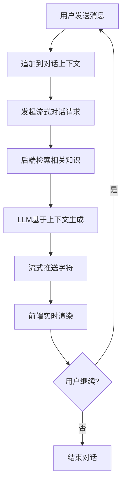

# 辰极智脑 - 知识库查询需求文档

## 一、修订记录

| 修订日期  | 修订内容                   | 修订人员 | 审核人员 |
| :-------- | :------------------------- | :------- | :------- |
| 2025-8-30 | 辰极智脑知识库查询功能初稿 | -        | -        |

---

## 二、需求背景与目标

### 2.1 编写目的

本文档旨在明确“辰极智脑”系统中“知识库查询”模块的功能需求、交互逻辑及非功能性指标。该模块是系统的核心价值出口，直接面向最终用户提供基于企业私有知识的智能问答与检索服务。

### 2.2 产品背景

在企业积累了海量非结构化数据（文档）并完成向量化处理后，需要通过高效、准确的检索与生成技术（RAG），将沉睡的知识转化为即时的业务洞察。本模块提供“检索模式”与“对话模式”两种交互形态，满足不同场景下的知识获取需求。

### 2.3 术语定义

* **RAG (Retrieval-Augmented Generation)**: 检索增强生成，先从知识库检索相关片段，再由 LLM 生成答案。
* **Mix Mode (混合检索)**: 同时结合关键词检索（BM25）与向量检索（Embedding）的优势，提高召回准确率。
* **SSE (Server-Sent Events)**: 服务器发送事件，用于实现流式响应，提升用户感知的响应速度。
* **Provider**: 底层 RAG 服务的提供者，负责具体的检索与生成逻辑。

---

## 三、用户角色与场景

### 3.1 用户角色

| 角色                 | 职责描述             | 权限范围                                                                         |
| :------------------- | :------------------- | :------------------------------------------------------------------------------- |
| **普通用户**   | 知识的使用者         | 使用检索模式查找具体问题的答案；使用对话模式进行多轮问答；查看自己的查询历史。   |
| **企业管理员** | 系统的维护者与监督者 | 拥有普通用户所有权限；可查看查询过程中的详细元数据与性能指标，用于调优系统效果。 |

### 3.2 典型场景

1. **精准问答**: 员工需要知道“公司差旅报销标准是多少？”，使用**检索模式**，系统直接给出精确段落及来源文档。
2. **知识探索**: 研究员对“生成式AI的发展历程”感兴趣，使用**对话模式**与系统进行多轮探讨，逐步深入。
3. **效果调优**: 管理员发现某类问题回答不准，通过查看查询结果的**置信度**和**元数据**，分析是检索召回问题还是模型生成问题。

---

## 四、业务流程

### 4.1 检索查询流程

### 4.2 对话交互流程

---

## 五、功能性需求

### 5.1 知识库概览

#### 原型图

（请插入知识库概览原型图）

#### 业务说明

在查询页面的顶部区域，直观展示当前知识库的规模与状态，增强用户对系统能力的感知。

* **文档数量**：当前知识库中已索引的文档总数（数据源：`/knowledge/stats`）。
* **文档块数**：文档被切分成的总片段（Chunk）数量（数据源：`/knowledge/stats`）。
* **实体数量**：知识图谱中提取的实体节点总数（数据源：`/knowledge/stats`）。
* **关系数量**：知识图谱中实体间的关联关系总数（数据源：`/knowledge/stats`）。

---

### 5.2 智能查询（检索模式）

#### 原型图

（请插入智能查询原型图）

#### 业务说明

提供类似搜索引擎的单次问答体验，强调答案的精准度与来源的可追溯性。

* **结果展示逻辑**：
  * **流式渲染**：答案内容通过 SSE 实时逐字显示，支持 Markdown 格式渲染（表格、代码块、列表）。
  * **来源引用**：明确列出生成答案所依据的源文档名称，点击标签可查看（预留）。
  * **置信度**：通过颜色进度条展示系统对答案的自信程度（绿色>0.8，橙色>0.6，红色<0.6）。
  * **元数据 (Metadata)**：展示检索过程中的中间事件（如“检索到X条记录”），增加透明度。
  * **性能指标**：展示总耗时、首Token耗时、输出长度等技术指标。
* **交互逻辑**：
  * 支持 `Ctrl+Enter` 快捷键提交。
  * 查询过程中锁定输入框，防止重复提交。

#### 界面字段说明

| 字段名               | 字段类型   | 校验/逻辑规则               | 说明                                                                                                                                                                                                            |
| :------------------- | :--------- | :-------------------------- | :-------------------------------------------------------------------------------------------------------------------------------------------------------------------------------------------------------------- |
| **查询输入框** | 多行文本框 | 必填；最大长度 2000 字符。  | 用户输入自然语言问题。支持换行。                                                                                                                                                                                |
| **查询模式**   | 下拉选择   | 默认选中“混合模式(Mix)”。 | **混合模式(Mix)**：结合关键词与向量检索（推荐）。` `**本地模式(Local)**：仅在本地库检索。` `**全局模式(Global)**：尝试跨文档检索。` `**朴素模式(Naive)**：基础向量检索。 |
| **响应类型**   | 下拉选择   | 默认选中“多段落”。        | **多段落**：详细解答。` `**单段落**：简明扼要。` `**单句**：定义类回答。` `**关键词**：仅提取核心词。                                                                    |

#### 界面操作说明

| 操作名称           | 触发条件                   | 操作说明                      | 影响/结果                                                                |
| :----------------- | :------------------------- | :---------------------------- | :----------------------------------------------------------------------- |
| **查询**     | 输入框非空时高亮可用。     | 点击按钮或按 `Ctrl+Enter`。 | 发起 SSE 流式请求；界面进入“生成中”状态；输入框暂时禁用。              |
| **取消**     | 仅在“生成中”状态下显示。 | 点击取消按钮。                | 中断当前的 SSE 连接；保留已生成的部分内容；恢复输入框可用状态。          |
| **刷新统计** | 随时可用。                 | 点击工具栏的刷新图标。        | 重新获取顶部“知识库概览”的实时数据。                                   |
| **导出**     | 仅在有查询结果时可用。     | 点击导出按钮。                | 将当前的问题、完整的答案、来源列表及元数据打包为 JSON 文件并下载到本地。 |

---

### 5.3 智能对话（对话模式）

#### 原型图

（请插入智能对话原型图）

#### 业务说明

提供类似 ChatGPT 的沉浸式聊天体验，支持上下文记忆，适合追问与探索。

* **交互逻辑**：
  * **气泡式界面**：区分“用户”（右侧，品牌色背景）与“AI助手”（左侧，白底）的消息气泡。
  * **流式响应**：AI 回复时显示“生成中...”状态，内容实时上屏。
  * **Markdown支持**：完美支持代码高亮、表格、公式等富文本格式。
* **调试面板 (Debug Info)**：
  * 这是一个可折叠区域，默认收起。包含：错误信息、元数据（SSE事件）、性能指标。

#### 界面字段说明

| 字段名               | 字段类型   | 校验/逻辑规则                          | 说明                       |
| :------------------- | :--------- | :------------------------------------- | :------------------------- |
| **消息输入框** | 多行文本框 | 必填；无严格长度限制（后端可能截断）。 | 支持换行；支持粘贴长文本。 |

#### 界面操作说明

| 操作名称            | 触发条件                             | 操作说明                        | 影响/结果                                                |
| :------------------ | :----------------------------------- | :------------------------------ | :------------------------------------------------------- |
| **发送**      | 输入框非空时可用。                   | 点击发送按钮或回车（无Shift）。 | 消息上屏；发起流式对话请求；滚动到底部。                 |
| **停止**      | 仅在生成过程中显示（替代发送按钮）。 | 点击停止按钮。                  | 立即中断流式生成；保留已生成内容。                       |
| **调试/隐藏** | 随时可用。                           | 点击调试按钮。                  | 切换调试面板的展开/收起状态。                            |
| **清空**      | 对话列表不为空时可用。               | 点击清空按钮。                  | 弹出二次确认框。确认后清空前端会话记录并重置后端上下文。 |

---

### 5.4 查询历史

#### 原型图

（请插入查询历史原型图）

#### 业务说明

系统自动记录用户的每一次检索（检索模式下），方便用户回溯历史问题。

* **存储机制**：历史记录主要保存在本地（LocalStorage），同时也支持从后端获取（预留接口）。
* **展示内容**：查询问题、查询时间、查询模式、简略答案。

#### 界面操作说明

| 操作名称           | 触发条件                             | 操作说明                                                       | 影响/结果                                          |
| :----------------- | :----------------------------------- | :------------------------------------------------------------- | :------------------------------------------------- |
| **点击回填** | 用户点击历史列表中的某条记录。       | 将历史记录中的问题自动填充到查询输入框，并展示对应的历史答案。 | 恢复到当时的查询结果状态，可续问或修改后重新查询。 |
| **删除**     | 鼠标悬停在历史记录上，点击删除图标。 | 删除单条历史记录。                                             | 该条记录从列表中移除；本地存储同步更新。           |
| **清空**     | 历史列表不为空时可用。               | 点击列表顶部的“清空”按钮。                                   | 弹出二次确认框。确认后移除所有历史记录。           |

---

## 六、非功能性需求

### 6.1 性能要求

| 指标               | 要求                                    |
| :----------------- | :-------------------------------------- |
| **首字延迟** | < 1.5秒（从发送请求到看到第一个字符）。 |
| **生成速度** | > 10 tokens/秒（保证阅读流畅性）。      |
| **并发支持** | 支持至少 20 个并发查询请求。            |

### 6.2 可靠性要求

| 指标                 | 要求                                                                             |
| :------------------- | :------------------------------------------------------------------------------- |
| **流式稳定性** | 在网络波动情况下，SSE 连接应具备自动重连机制（前端已实现自动重试）。             |
| **错误处理**   | 后端发生异常（如 Provider 不可用）时，前端应优雅展示错误提示，而非白屏或无响应。 |

### 6.3 安全性要求

| 指标               | 要求                                                           |
| :----------------- | :------------------------------------------------------------- |
| **权限隔离** | 用户只能检索到其所属企业（Tenant）下的知识库内容。             |
| **内容过滤** | 严禁生成涉黄、涉政等违规内容（依赖底层模型能力与敏感词过滤）。 |
