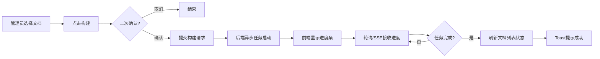

# 辰极智脑 - 知识库管理与构建需求说明书

## 一、修订记录

| 修订日期   | 修订内容                               | 修订人员 | 审核人员 |
| :--------- | :------------------------------------- | :------- | :------- |
| 2025-12-08 | 辰极智脑知识库管理与构建功能初稿       | 待定     | 待定     |

---

## 二、需求背景与目标

### 2.1 编写目的

本文档旨在明确“辰极智脑”系统中“知识库管理”模块的功能需求。该模块是用户对知识数据进行生产和维护的核心工作台，负责文档的上传后处理、索引构建及生命周期管理。

### 2.2 产品背景

知识库管理的功能形态高度依赖于当前激活的 RAG 引擎类型：

1. **LightRAG 模式（本地构建）**：系统拥有完整控制权。用户在此界面触发文档的解析、分块和向量化构建任务。
2. **VikingDB 模式（云端托管）**：系统处于“只读”状态。本模块仅作为云端知识库的浏览器，引导用户前往火山引擎控制台进行管理。

此模块对应的代码实现主要位于前端 `KnowledgeBaseView.vue` 及后端 `knowledge_build_routes.py`。

---

## 三、用户角色与场景

### 3.1 用户角色

| 角色           | LightRAG 模式权限                                            | VikingDB 模式权限                                            |
| :------------- | :----------------------------------------------------------- | :----------------------------------------------------------- |
| **企业管理员** | **完全权限**。可触发构建、重新构建、清空指定文档索引、清空整个知识库。 | **查看权限**。仅能查看集合列表，无操作权限。                 |
| **普通用户**   | **只读权限**。查看文档的构建状态（已索引/未索引）。          | **查看权限**。查看可用的知识集合。                           |

### 3.2 典型场景

1. **新文档入库**：管理员在“文档管理”模块上传了《员工手册.pdf》，随后进入“知识库管理”，发现该文档状态为“未索引”。管理员选中它，点击“构建”，等待进度条跑完，文档状态变为“已索引”。
2. **知识更新**：文档更新版本后，状态变为“更新待重构”。管理员点击“重新构建”，系统自动覆盖旧版本的向量数据。
3. **模式告知**：管理员切换到 VikingDB 模式，进入此页面，看到提示“当前为云端托管模式”，并点击链接跳转到火山引擎控制台去创建一个新的 Collection。

---

## 四、业务流程

### 4.1 本地知识构建流程 (LightRAG)

---

## 五、功能性需求

### 5.1 模式自适应展示

#### 对应的代码逻辑

`shouldShowKnowledgeManagement` (computed property)

#### 功能描述

页面需根据 `ragStore.isLightRAGMode` 的值自动切换视图。

1. **LightRAG 模式**：显示完整的管理界面（概览卡片、构建配置、文档浏览器）。
2. **VikingDB 模式**：隐藏管理界面，仅显示 `ProviderRedirectPage` 组件（重定向提示页）。

---

### 5.2 知识库管理 (LightRAG 模式)

当处于 LightRAG 模式时，界面包含以下功能区块：

#### 5.2.1 知识库概览 (Knowledge Overview)

* **组件**：`KnowledgeOverview.vue`
* **功能**：展示知识库的整体健康度。
  * **已处理文档**：统计知识库中已建立索引的文档总数。
  * **总向量块数**：统计 Chunk 总数，反映知识库规模。
  * **最后更新**：最后一次成功构建的时间。

#### 5.2.2 构建配置 (Build Configuration)

* **组件**：`BuildConfigurationCard.vue`
* **功能**：在触发构建前，允许临时调整策略（可选，默认为折叠或只读状态）。
  * **Chunk Size**：分块字符数（如 500）。
  * **Overlap**：分块重叠字符数（如 50）。
  * **校验**：前端需校验参数合法性（必须为正整数）。

#### 5.2.3 文档浏览器 (Document Browser)

* **组件**：`DocumentBrowser.vue`
* **视图模式**：采用卡片式布局 (Grid) 或列表布局 (List) 展示系统中的文档。
* **文档状态**：
  * **已索引 (Processed)**：绿色标签，表示已入库，可被检索。
  * **未索引 (Unprocessed)**：灰色标签，表示仅上传未入库。
  * **处理中 (Processing)**：蓝色标签，显示加载动画。
  * **失败 (Failed)**：红色标签，显示错误提示图标。
* **操作动作**：
  * **构建 (Build)**：对“未索引”文档可见。点击后触发单文档构建。
  * **重新构建 (Rebuild)**：对“已索引”文档可见。点击后弹窗提示“将覆盖旧数据”。
  * **清除数据 (Clear)**：点击后仅删除该文档的向量数据，文档变为“未索引”状态。

#### 5.2.4 构建进度与结果 (Progress & Result)

* **组件**：`BuildProgressCard.vue`, `BuildResultCard.vue`
* **功能**：
  * **进度反馈**：后端异步处理时，前端展示进度条（0-100%）。支持“取消构建”操作。
  * **结果报告**：构建结束后，展示本次任务的统计（成功 N 个，失败 M 个）。

#### 5.2.5 全局破坏性操作

* **位置**：页面头部或右上角菜单。
* **功能**：**清空知识库 (Clear Knowledge Base)**。
* **交互**：必须弹出高风险警示框（MessageBox），需用户明确点击“确认清空”后，才调用后端接口删除所有索引文件。

---

### 5.3 云端模式提示 (VikingDB 模式)

#### 对应的代码组件

`ProviderRedirectPage.vue`

#### 功能描述

当处于 VikingDB 模式时，拦截所有构建操作。

1. **提示信息**：大字号提示“当前使用 VikingDB 云端引擎托管”。
2. **引导操作**：提供“前往火山引擎控制台”的超链接按钮。
3. **技术说明**：简要说明云端模式下，文档的 Parse 和 Chunk 均由云端服务自动处理，无需本地干预。

---

## 六、非功能性需求

### 6.1 性能与反馈

1. **大文件处理**：对于超过 20MB 的大文件，点击构建后应立即进入“处理中”状态，避免前端长时间 Loading 无响应。
2. **并发控制**：前端应限制同时触发构建的文档数量（或后端队列机制），防止瞬间因显存耗尽导致 LightRAG 服务崩溃。

### 6.2 异常处理

1. **构建失败**：如果某份文档构建失败（如格式损坏），不能中断整个批次任务，应标记该文档为“Failed”并继续处理下一个，最后在结果卡片中汇总展示。
