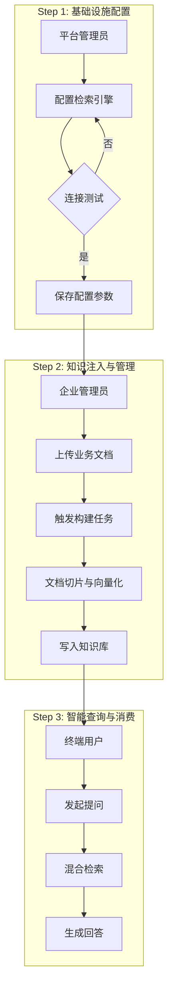
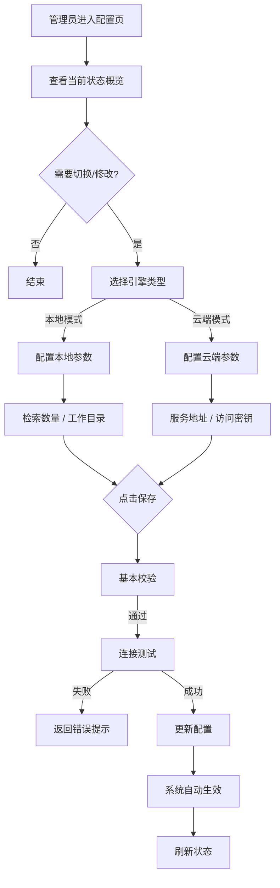
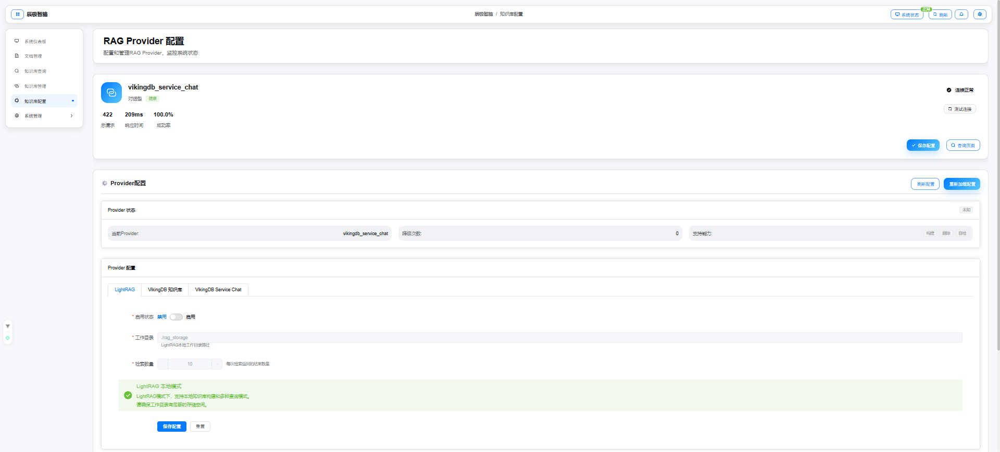
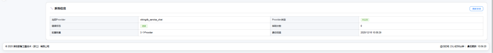

# 辰极智脑 - 知识库配置需求说明书

## 一、修订记录

| 修订日期   | 修订内容                   | 修订人员 | 审核人员 |
| :--------- | :------------------------- | :------- | :------- |
| 2025-12-08 | 辰极智脑知识库配置功能初稿 | 待定     | 待定     |

---

## 二、需求背景与目标

### 2.1 编写目的

本文档旨在明确"辰极智脑"系统中"知识库配置"模块的功能需求。该模块是系统的底层引擎控制中心，用于管理知识检索引擎的选型、连接参数及全局检索策略。

### 2.2 产品背景

系统支持两种知识检索引擎模式，需提供统一的配置入口：

1. **本地模式（LightRAG）**：基于本地文件系统和图数据库，适合数据隐私要求高、离线部署的场景。
2. **云端模式（VikingDB）**：集成火山引擎知识库服务，适合大规模数据检索和企业级托管场景。

---

### 2.3 知识库体系全景与依赖关系

本系统的三个核心模块（配置、管理、查询）存在严格的单向依赖和流转关系。理解这一关系对于正确使用系统至关重要。

* **配置**是地基：决定了系统"大脑"的物理构造（本地还是云端）。
* **管理**是燃料：依赖配置好的连接，将原始数据转化为系统可理解的知识。
* **查询**是输出：依赖前两步的成果，向最终用户交付价值。

#### 依赖流转图

---

## 三、用户角色与权限

| 角色                 | 职责描述                           | 权限范围                                                                                 |
| :------------------- | :--------------------------------- | :--------------------------------------------------------------------------------------- |
| **平台管理员** | 负责系统的基础设施维护与引擎选型。 | 拥有**完全读写权限**。可以切换引擎、修改访问密钥、调整全局检索参数。               |
| **企业管理员** | 负责业务层面的监控。               | 仅拥有**只读权限**。只能查看当前使用的引擎类型及公开参数，无法查看密钥或修改配置。 |
| **普通用户**   | 无。                               | **无访问权限**。菜单中不可见此模块。                                               |

---

## 四、业务流程

### 4.1 引擎切换与配置流程

---

## 五、功能性需求

### 原型图

### 5.1 状态概览

#### 功能描述

在页面顶部展示当前知识检索引擎的运行健康状态。

1. **当前引擎**：指示当前生效的是"本地模式"还是"云端模式"。
2. **健康状态**：
   * **健康（绿色）**：引擎连接正常，服务响应及时。
   * **异常（红色）**：连接断开、鉴权失败或服务不可用。
   * **未知（灰色）**：正在检查或初始化中。
3. **核心指标**：
   * **降级次数**：展示最近发生的自动降级次数（如主引擎失败自动切换到备用的次数）。
   * **最后错误**：如有错误，展示最后一条报错简述。

### 5.2 核心配置

#### 5.2.1 引擎选择

* 提供单选框或切换卡片，在"本地模式"和"云端模式"之间切换。
* **互斥逻辑**：同一时间只能激活一种引擎。

#### 5.2.2 云端模式配置详情

当选择云端模式时，需填写以下参数：

1. **服务地址**：火山引擎知识库服务的访问地址。
2. **区域**：服务所在的物理区域（如"北京"）。
3. **访问密钥 ID**：
   * **展示规则**：若已配置，显示为掩码（如"******"）。
   * **编辑规则**：支持清空重填。
4. **访问密钥 Secret**：
   * **展示规则**：始终显示为掩码。
   * **编辑规则**：仅支持重置，不可查看明文。
5. **检索数量**：单次检索召回的文档数量，默认为 10。

#### 5.2.3 本地模式配置详情

当选择本地模式时，需配置以下参数：

1. **检索数量**：检索召回数量，默认为 10。
2. **工作目录**：本地数据存储路径。
   * **只读展示**：通常在部署时固定，界面上仅做展示，防止随意修改导致数据丢失。

### 5.3 高级配置

#### 功能描述

提供即时重载和调试功能，默认折叠隐藏。

1. **重新加载配置**：提供"重新加载配置"按钮。点击后系统重新读取配置并生效，无需重启服务。
2. **指标重置**：提供"重置统计指标"按钮，清空累计的降级计数和调用统计。

---

## 六、非功能性需求

### 6.1 安全性

1. **数据脱敏**：获取配置列表时，系统必须自动将访问密钥替换为掩码或空字符串返回。
2. **掩码拦截**：提交更新时，若密钥字段仍为掩码格式，系统应忽略该字段的更新，保持原值不变。

### 6.2 交互体验

1. **保存反馈**：点击保存后，按钮显示"正在保存/测试连接..."，禁用点击。
2. **错误提示**：若连接测试失败，需直接在输入框下方或页面顶部显示具体的错误原因（如"认证失败，请检查访问密钥"），而非通用的"保存失败"。
