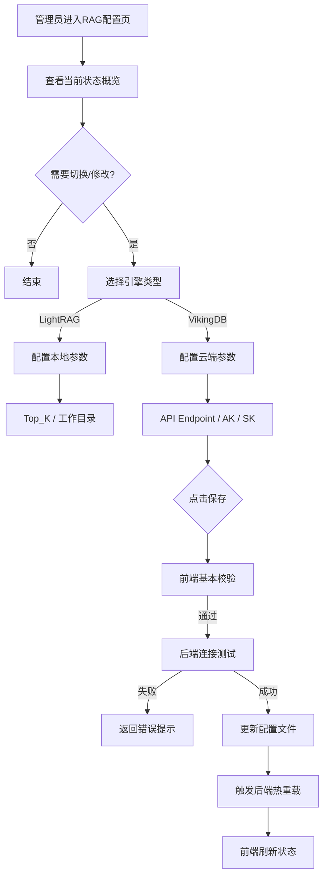

# 辰极智脑 - 知识库配置需求说明书

## 一、修订记录

| 修订日期   | 修订内容                             | 修订人员 | 审核人员 |
| :--------- | :----------------------------------- | :------- | :------- |
| 2025-12-08 | 辰极智脑知识库配置功能初稿           | 待定     | 待定     |

---

## 二、需求背景与目标

### 2.1 编写目的

本文档旨在明确“辰极智脑”系统中“知识库配置”模块的功能需求。该模块是系统的底层引擎控制中心，用于管理 RAG（检索增强生成）引擎的选型、连接参数及全局检索策略。

### 2.2 产品背景

系统支持两种 RAG 引擎模式，需提供统一的配置入口：

1. **LightRAG（本地模式）**：基于本地文件系统和图数据库，适合数据隐私要求高、离线部署的场景。
2. **VikingDB（云端模式）**：集成火山引擎 VikingDB 服务，适合大规模数据检索和企业级托管场景。

此模块对应的代码实现主要位于前端 `RagConfigView.vue` 及后端 `rag_routes.py`。

---

## 三、用户角色与权限

| 角色           | 职责描述                                       | 权限范围                                                     |
| :------------- | :--------------------------------------------- | :----------------------------------------------------------- |
| **平台管理员** | 负责系统的基础设施维护与引擎选型。             | 拥有**完全读写权限**。可以切换引擎、修改 AK/SK、调整全局检索参数。 |
| **企业管理员** | 负责业务层面的监控。                           | 仅拥有**只读权限**。只能查看当前使用的引擎类型及公开参数（如 Top_k），无法查看密钥或修改配置。 |
| **普通用户**   | 无。                                           | **无访问权限**。菜单中不可见此模块。                         |

---

## 四、业务流程

### 4.1 引擎切换与配置流程

---

## 五、功能性需求

### 5.1 状态概览 (Status Overview)

#### 对应的代码组件

`ConfigurationStatusOverview.vue`

#### 功能描述

在页面顶部展示当前 RAG 引擎的运行健康状态。

1. **当前引擎**：指示当前生效的是 "LightRAG" 还是 "VikingDB"。
2. **健康状态**：
    * **健康 (Green)**：引擎连接正常，API 响应及时。
    * **异常 (Red)**：连接断开、鉴权失败或服务不可用。
    * **未知 (Grey)**：正在检查或初始化中。
3. **核心指标**：
    * **Fallback 次数**：展示最近发生的降级（Fallback）次数（如主引擎失败自动切换到备用的次数）。
    * **最后错误**：如有错误，展示最后一条报错简述。

### 5.2 核心配置 (Core Configuration)

#### 对应的代码组件

`ProviderConfigurationSection.vue`

#### 5.2.1 引擎选择

* 提供单选框或切换卡片，在 "LightRAG" 和 "VikingDB" 之间切换。
* **互斥逻辑**：同一时间只能激活一种引擎。

#### 5.2.2 VikingDB 配置详情

当选择 VikingDB 时，需填写以下参数：

1. **API Endpoint**：火山引擎 VikingDB 服务的访问地址（如 `https://api-vikingdb.volces.com`）。
2. **Region (区域)**：服务所在的物理区域（如 `cn-beijing`）。
3. **Access Key (AK)**：访问密钥 ID。
    * **展示规则**：若已配置，显示为掩码 `******`。
    * **编辑规则**：支持清空重填。
4. **Secret Key (SK)**：访问密钥 Secret。
    * **展示规则**：始终显示为掩码 `******`。
    * **编辑规则**：仅支持重置，不可查看明文。
5. **Retrieval Size**：单次检索召回的文档数量，默认为 10。

#### 5.2.3 LightRAG 配置详情

当选择 LightRAG 时，需配置以下参数：

1. **Top_K**：检索召回数量，默认为 10。
2. **Working Directory**：本地数据存储路径，默认为 `./rag_storage`。
    * **只读展示**：通常在部署时通过环境变量固定，界面上仅做展示，防止随意修改导致数据丢失。

### 5.3 高级配置 (Advanced Configuration)

#### 对应的代码组件

`AdvancedConfigurationPanel.vue` (折叠面板)

#### 功能描述

提供即时重载和调试功能。

1. **热重载 (Reload)**：提供“重新加载配置”按钮。点击后调用 `/rag/config/reload` 接口，强制后端重新读取配置文件并初始化连接池，无需重启服务进程。
2. **指标重置**：提供“重置统计指标”按钮，清空累计的 Fallback 计数和 API 调用统计。

---

## 六、非功能性需求

### 6.1 安全性

1. **数据脱敏**：前端调用 `/rag/providers` 获取配置列表时，后端必须自动将 AK/SK 替换为 `******` 或空字符串。
2. **掩码拦截**：前端提交更新时，若 AK/SK 字段仍为掩码（如 `******`），后端应忽略该字段的更新，保持原值不变。

### 6.2 交互体验

1. **保存反馈**：点击保存后，按钮显示“正在保存/测试连接...”，禁用点击。
2. **错误提示**：若连接测试失败（如 AK 错误），需直接在输入框下方或页面顶部显示具体的错误原因（“认证失败，请检查 Access Key”），而非通用的“保存失败”。
