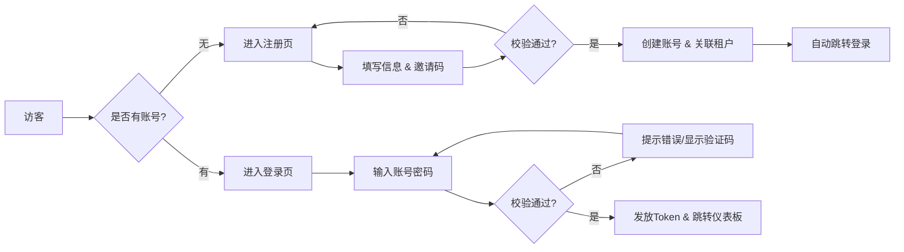
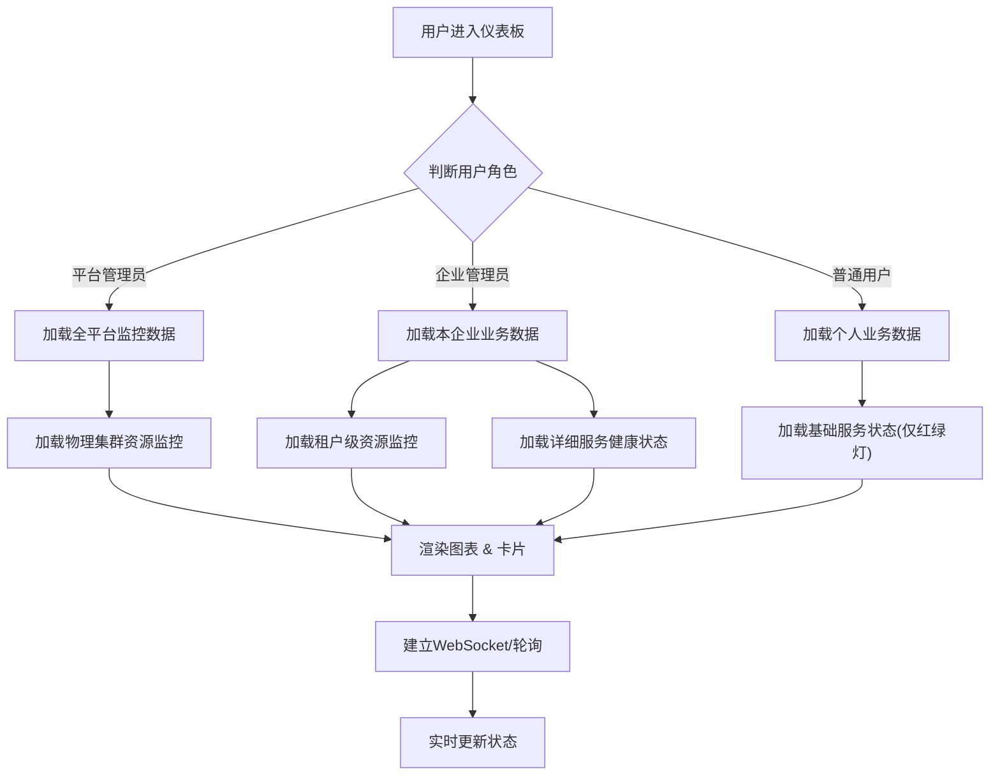
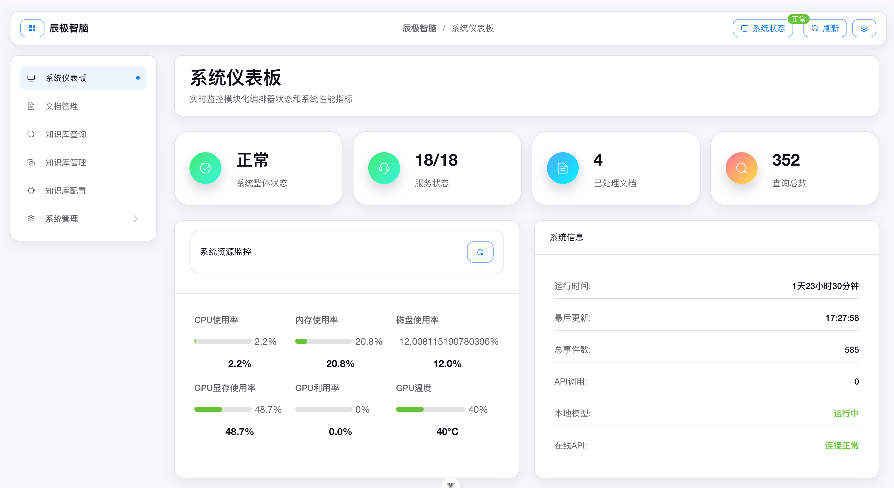
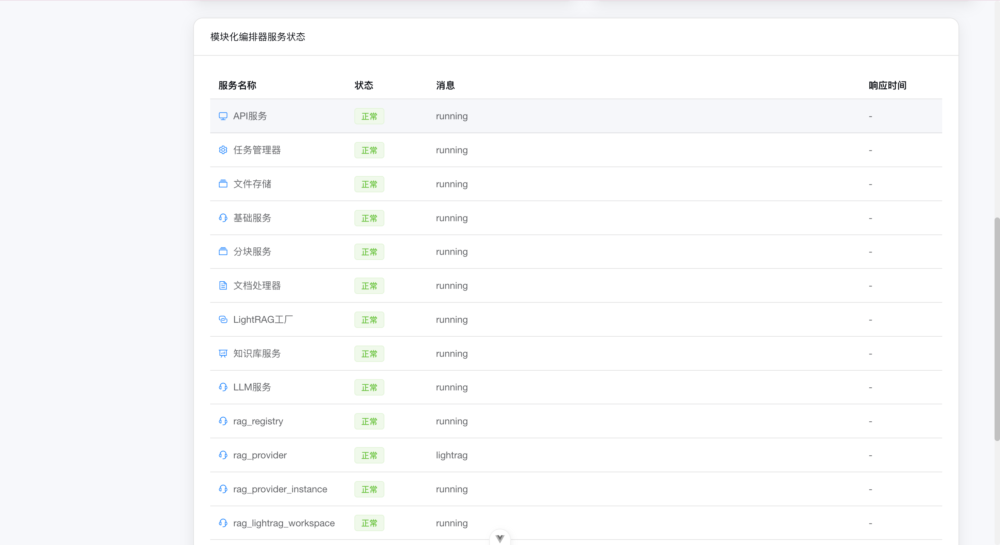
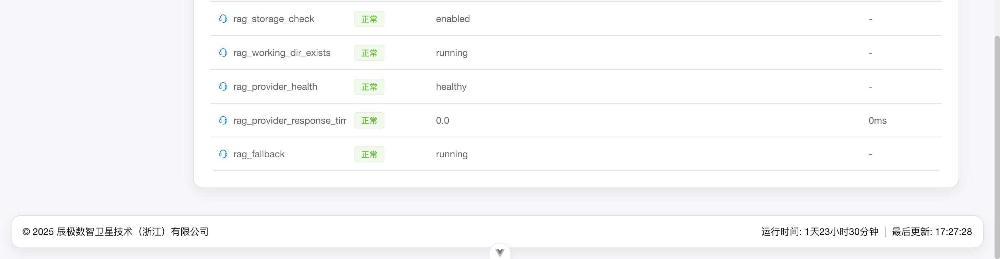

# 辰极智脑 - 认证与仪表盘需求文档

## 一、修订记录

| 修订日期   | 修订内容                     | 修订人员 | 审核人员 |
| :--------- | :--------------------------- | :------- | :------- |
| 2025-12-05 | 辰极智脑认证与仪表盘功能初稿 | 陈文静   | -        |

---

## 二、需求背景与目标

### 2.1 编写目的

本文档旨在明确“辰极智脑”系统中“用户注册”、“用户登录”及“系统仪表板”模块的功能需求、交互逻辑及非功能性指标。该文档将作为UI设计、前端开发、后端开发及测试用例编写的依据。

### 2.2 产品背景

“辰极智脑”作为企业级AI服务中台，安全性与可观测性是其基石。

* **认证体系**：需要构建安全、高效的准入机制，确保仅授权用户可访问系统，并严格区分企业管理员与普通用户的身份边界。
* **系统仪表板**：作为用户登录后的首屏，需要直观展示系统的运行健康度（如GPU/CPU状态）、服务可用性及核心业务指标（如文档处理量、查询量），帮助用户快速感知系统水位。
* **认证体系**：需要构建安全、高效的准入机制，确保仅授权用户可访问系统，并严格区分企业管理员与普通用户的身份边界。
* **系统仪表板**：作为用户登录后的首屏，需要直观展示系统的运行健康度（如GPU/CPU状态）、服务可用性及核心业务指标（如文档处理量、查询量），帮助用户快速感知系统水位。

### 2.3 术语定义

* **Tenant (租户/企业)**：系统的顶层逻辑隔离单位，一个企业对应一个 Tenant。
* **JWT (JSON Web Token)**：用于在网络应用环境间传递声明而执行的一种基于JSON的开放标准，本系统用于身份验证。
* **QPS (Queries Per Second)**：每秒查询率，衡量系统吞吐量的重要指标。
* **GPU (Graphics Processing Unit)**：图形处理器，本系统中用于承载 LLM 推理和 Embedding 向量化计算的核心硬件。

### 2.4 系统边界与依赖

本系统（辰极智脑）专注于 AI 能力的供给与编排，**不包含**原生的用户注册与组织架构管理功能。所有身份认证与权限控制均依赖外部的 **中央管理系统 (ts_manage)**。

* **ts_manage 职责**：
  * **用户管理**：负责账号创建、密码重置、用户信息维护。
  * **租户管理**：负责企业（Tenant）的生命周期管理及组织架构树的维护。
  * **权限中心**：负责定义角色（Role）及分配菜单路由权限。
* **辰极智脑 职责**：
  * **认证代理**：提供登录界面，将认证请求透传至 ts_manage，并缓存返回的 Token。
  * **权限消费**：根据 ts_manage 返回的路由表，动态渲染前端菜单与页面。

---

## 三、用户角色与场景

### 3.1 用户角色

| 角色                 | 职责描述             | 权限范围                                                                                                        |
| :------------------- | :------------------- | :-------------------------------------------------------------------------------------------------------------- |
| **访客**       | 未登录用户           | 仅能访问登录页、注册页；无法访问系统内部功能。                                                                  |
| **普通用户**   | 知识的使用者         | 注册/登录系统；查看**个人**的业务统计数据（如个人文档数）；查看基础服务状态。                             |
| **企业管理员** | 企业内系统的维护者   | 注册/登录系统；查看**本企业**的全局业务统计数据；查看系统硬件资源监控（CPU/GPU/内存）及详细服务健康报告。 |
| **平台管理员** | 整个平台的超级管理者 | 管理所有租户（企业）的生命周期（开通/禁用）；管理全局系统配置（如模型接入）；查看全平台系统级监控与日志。       |

### 3.2 典型场景

1. **账号分发**：企业管理员在 **ts_manage** 后台为新员工创建账号并分配“普通用户”角色，员工获取账号后即可登录辰极智脑。
2. **日常登录**：用户通过账号密码登录系统，系统自动向 ts_manage 发起认证；若**连续3次**输错密码，ts_manage 将要求校验图形验证码。
3. **系统巡检**：企业管理员登录后，在仪表板查看 GPU 显存使用率和 LLM 服务响应时间，评估是否需要扩容。
4. **业务概览**：普通用户登录后，在仪表板查看自己上传的文档处理进度和今日查询次数。

---

## 四、业务流程

### 4.1 登录注册流程

### 4.2 仪表板数据加载流程

---

## 五、功能性需求

### 5.1 认证集成说明

#### 业务说明

本系统不提供用户注册入口。所有用户的生命周期管理（创建、编辑、禁用、删除）均在 **中央管理系统 (ts_manage)** 中完成。

1. **账号获取**：
   * **企业开通**：由平台管理员在 ts_manage 中创建“租户”及“企业管理员”账号。
   * **员工入职**：由企业管理员在 ts_manage 中创建“员工账号”并分配权限。
2. **密码管理**：
   * 初始密码由管理员在创建时指定。
   * **忘记密码**：用户需联系所属企业的管理员，在 ts_manage 后台进行密码重置。
3. **数据同步**：
   * 用户登录成功后，本系统会缓存 ts_manage 返回的用户基本信息（如 UserID, TenantID, Role），用于后续的业务逻辑判断。

---

### 5.2 用户登录

#### 原型图

（请插入登录页原型图）

#### 业务说明

1. **登录方式**：账号 + 密码。
   * **交互流程**：用户输入账号和密码后，点击“登录”按钮或按回车键。系统首先进行前端格式校验（如非空校验、长度限制），校验通过后自动提交至后台进行身份验证。
2. **认证代理逻辑**：
   * **安全传输**：系统采用前后端分离的认证机制。前端界面收集用户凭证并加密传输，后端服务作为安全代理，将认证请求转发至中央管理系统 (ts_manage) 进行核验。
   * **会话保持**：验证通过后，系统建立本地会话并缓存用户权限信息，确保后续访问的流畅性。
3. **安全机制**（依赖 ts_manage）：
   * **验证码**：当系统检测到异常登录尝试（如密码错误）时，会自动触发验证码机制，要求用户输入图形验证码以继续。
   * **账户锁定**：为保障账户安全，系统执行严格的锁定策略：若用户连续输入错误密码达到 **10次**，该账户将被临时锁定 **30分钟**。锁定期间无法登录，需等待自动解锁或联系管理员重置。
4. **登录反馈**：
   * 成功：跳转至系统仪表板，右上角显示“欢迎回来，{用户名}”。
   * 失败：直接展示 `ts_manage` 返回的错误信息（如“用户名或密码错误”）。
5. **忘记密码**：登录页提供“忘记密码”链接，点击后弹出提示“请联系贵公司的企业管理员在中央管理系统中重置密码”。
6. **主题切换**：登录页提供“深色/浅色”主题切换按钮，偏好设置保存在本地浏览器。

#### 界面字段说明

| 字段名 | 字段类型 | 是否必填 | 说明                              |
| :----- | :------- | :------- | :-------------------------------- |
| 用户名 | 文本输入 | 是       | 支持用户名或邮箱登录。            |
| 密码   | 密码输入 | 是       | 密文显示，支持“显示/隐藏”切换。 |
| 验证码 | 文本输入 | 条件显示 | 登录失败3次后出现。               |

#### 界面操作说明

| 操作名称   | 操作说明                                      |
| :--------- | :-------------------------------------------- |
| 登录       | 提交凭证，成功后获取 Token 并存储，跳转首页。 |
| 刷新验证码 | 点击验证码图片，重新获取一张新图片。          |
| 切换主题   | 点击月亮/太阳图标，切换界面深色/浅色模式。    |

---

### 5.3 系统仪表板

#### 原型图

#### 业务说明

1. **数据权限与视图隔离**：

   * **平台管理员视图**：
     * **业务概览**：展示**全平台**租户总数、总文档数、总查询数、物理集群整体资源使用率。
     * **资源监控**：展示所有物理节点的 CPU、内存、磁盘、GPU 状态，不区分租户。
     * **系统日志**：展示系统级异常日志和全局服务健康状态。
   * **企业管理员视图**：
     * **业务概览**：展示**本企业**的总文档数、总查询数、今日上传数、总存储量。
     * **资源监控**：展示本企业分配到的资源配额使用情况（如 GPU 显存占用）。
     * **服务状态**：展示所有微服务（如 LLM服务、分块服务、知识库服务）的详细健康状态、响应时间及错误信息。
   * **普通用户视图**：
     * **业务概览**：仅展示**个人**上传的文档数、个人的查询数、个人今日上传数。
     * **资源监控**：**不展示**（或仅展示系统整体负载状态：空闲/繁忙）。
     * **服务状态**：仅展示核心服务（如 知识库检索）的“可用/不可用”红绿灯状态，隐藏技术细节。
2. **实时性要求**：

   * **资源监控**：每 5 秒自动刷新一次（或通过 WebSocket 推送）。
   * **业务概览**：每 30 秒自动刷新一次，或在用户执行操作后触发刷新。
3. **状态可视化**：

   * **健康度**：使用颜色区分（绿色-正常，橙色-警告，红色-错误）。
   * **趋势图**：(可选) 展示近24小时的 QPS 或 Token 消耗趋势。

#### 界面字段说明

| 字段名             | 字段类型      | 说明                                           |
| :----------------- | :------------ | :--------------------------------------------- |
| **统计卡片** |               |                                                |
| 系统整体状态       | 状态卡片      | 展示系统综合健康评分或状态（正常/警告/错误）。 |
| 服务状态概览       | 状态卡片      | 展示“正常服务数 / 总服务数”。                |
| 已处理文档         | 数字卡片      | 管理员看企业总数，用户看个人总数。             |
| 查询总数           | 数字卡片      | 管理员看企业总数，用户看个人总数。             |
| **资源监控** |               | **仅管理员可见**                         |
| CPU使用率          | 进度条/仪表盘 | 精确到小数点后1位。                            |
| 内存使用率         | 进度条/仪表盘 | 精确到小数点后1位。                            |
| GPU显存            | 进度条/仪表盘 | 展示显存占用百分比。                           |
| GPU温度            | 进度条        | 超过80度标红预警。                             |
| **服务列表** |               |                                                |
| 服务名称           | 文本          | 如“LLM服务”、“文档处理器”。                |
| 状态               | 标签          | 运行中(绿) / 异常(红) / 未知(灰)。             |
| 响应时间           | 数字          | 单位 ms，超过 1000ms 标黄。                    |

#### 界面操作说明

| 操作名称 | 操作说明                                          |
| :------- | :------------------------------------------------ |
| 刷新数据 | 点击右上角刷新按钮，强制重新加载所有监控数据。    |
| 查看详情 | (预留) 点击某个服务，跳转至该服务的详细日志页面。 |

---

## 六、非功能性需求

### 6.1 安全性

* **传输加密**：所有登录注册请求必须通过 HTTPS 传输。
* **敏感信息脱敏**：日志中严禁记录明文密码。
* **防暴破**：验证码机制必须在后端强制校验，防止绕过前端直接调接口。

### 6.2 性能要求

* **登录响应**：登录接口响应时间 < 500ms。
* **仪表板加载**：首屏数据加载时间 < 1秒。
* **监控延迟**：资源监控数据的延迟不超过 5 秒。

### 6.3 浏览器兼容性

* 支持 Chrome 80+, Firefox 70+, Safari 13+, Edge 80+。
* 仪表板需支持响应式布局，适配 1920x1080 及 1366x768 分辨率，移动端仅展示核心统计卡片。
