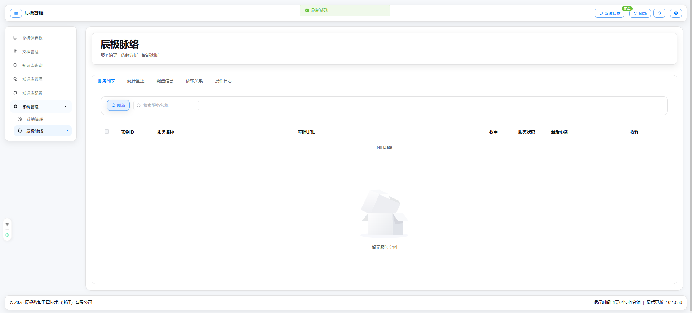
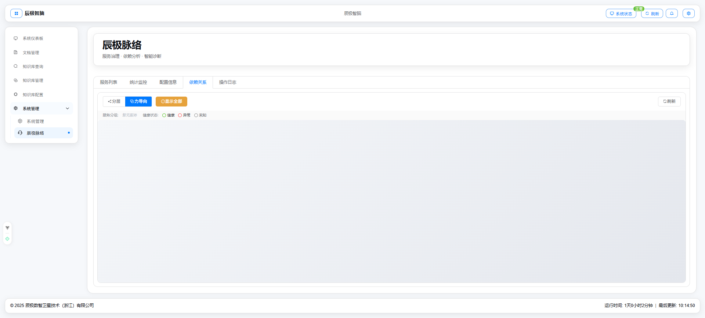
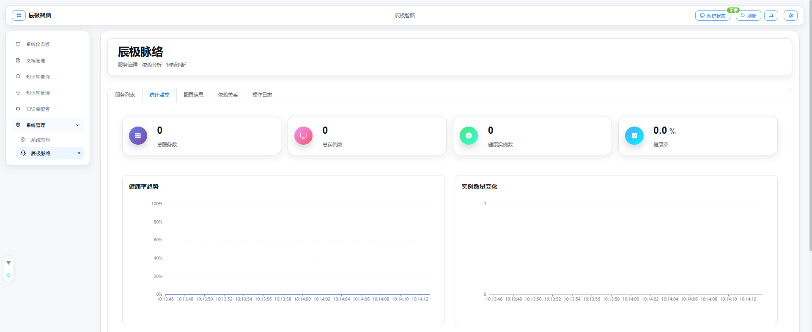
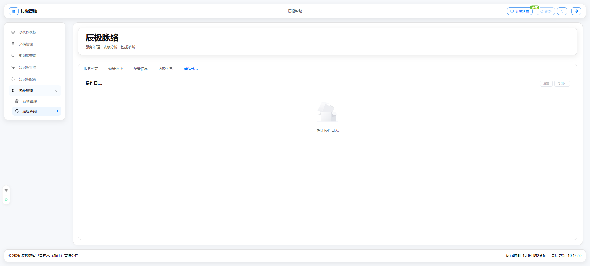

# 辰极脉络 - 服务治理与智能诊断需求说明书

## 一、修订记录

| 修订日期   | 修订内容                 | 修订人员 | 审核人员 |
| :--------- | :----------------------- | :------- | :------- |
| 2025-12-11 | 辰极脉络服务治理功能初稿 | 待定     | 待定     |

---

## 二、需求背景与目标

### 2.1 编写目的

本文档旨在明确"辰极脉络"模块的功能需求。作为基于微服务架构的 AI 中台，系统内部包含多个独立服务（如文档解析服务、向量化服务、大模型推理服务等）。"辰极脉络"旨在提供一个统一的**服务注册中心与治理平台**，实现服务发现、状态监控、依赖分析与故障诊断。

### 2.2 产品背景

随着业务扩展，微服务数量日益增加，手动维护服务列表及排查调用链路故障变得极其困难。系统需要一个可视化的控制台：

1. **自动发现**：服务实例启动时自动注册，宕机时自动摘除。
2. **依赖可视**：清晰展示服务间的上下游调用关系。
3. **智能诊断**：自动分析服务健康状态，辅助定位系统瓶颈或故障根因。

---

## 三、用户角色与权限

| 角色                 | 职责描述                               | 权限范围                                                |
| :------------------- | :------------------------------------- | :------------------------------------------------------ |
| **平台管理员** | 负责微服务架构的运维保障与稳定性维护。 | **完全权限**。可下线/重启服务实例，修改治理策略。 |
| **开发人员**   | 排查服务调用链路和问题定位。           | **只读权限**。查看服务列表、日志和依赖图谱。      |

---

## 四、功能架构

辰极脉络界面采用标签页式布局，分为以下核心模块：

1. **服务列表**：实例级的管理视图。
2. **统计监控**：服务整体健康度与流量统计。
3. **配置信息**：注册中心自身的参数配置。
4. **依赖关系**：可视化的服务拓扑图。
5. **操作日志**：治理操作的审计记录。

---

## 五、功能性需求

### 5.1 服务列表管理

#### 原型图

#### 功能描述

展示当前注册中心内所有已注册的服务实例。

* **列表字段**：
  * **服务名称**：服务的业务名称。
  * **实例编号**：唯一标识符。
  * **地址**：服务的网络地址和端口。
  * **状态**：健康、禁用、异常。
  * **最后心跳**：最后一次上报心跳的时间。
* **管理操作**：
  * **单实例操作**：
    * **禁用**：暂时切断该实例的流量，但保留其注册信息。
    * **启用**：恢复实例流量。
    * **删除**：将实例从注册表中永久移除。
      * *安全机制*：若删除处于"健康"状态的实例，需弹出红色高危警示框进行二次确认。
  * **批量操作**：支持多选实例，进行批量启用、禁用或删除。

### 5.2 依赖关系拓扑图

#### 原型图

#### 功能描述

通过图形化方式展示服务间的调用依赖，帮助了解系统架构与故障传递路径。

* **可视化**：使用网络拓扑图展示节点（服务）与连线（调用关系）。
* **状态映射**：
  * 节点颜色代表健康度（绿色=健康，红色=故障，黄色=警告）。
  * 连线粗细代表流量大小。
* **交互**：点击节点可查看详情，或高亮其上下游关联节点。
* **自动刷新**：支持定期自动更新拓扑结构。

### 5.3 统计监控

#### 原型图

#### 功能描述

展示注册中心的宏观运行指标。

* **核心卡片**：
  * 服务总数 / 实例总数。
  * 健康实例占比。
  * 今日注册/注销频次。
* **趋势图表**：
  * 服务实例数变化趋势（折线图）。
  * 各服务流量占比（饼图）。

### 5.4 智能诊断与日志

#### 原型图

#### 功能描述

* **实时事件**：监听注册中心事件（如"新实例上线"、"实例心跳超时"），并即时在页面右下角弹出通知。
* **自动诊断**：
  * 当检测到核心服务下线时，自动触发警报并记录日志。
* **操作审计**：记录管理员的每一次"禁用"、"删除"操作，包括操作人、时间、对象及结果。

---

## 六、非功能性需求

### 6.1 实时性与一致性

* **自动发现**：页面须实时获取最新数据，服务列表的更新延迟应控制在 5 秒以内。
* **静默刷新**：自动刷新数据时，不应导致页面闪烁或重置用户的滚动条位置。

### 6.2 容错性

* **批量操作反馈**：批量操作应反馈具体的成功/失败数量（如"成功 3 个，失败 1 个"），而非笼统的错误提示。
* **数据加载**：依赖图谱加载较慢时，需提供加载状态遮罩。
