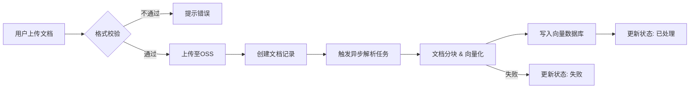

# 辰极智脑 - 文档管理需求说明书

## 一、修订记录

| 修订日期 | 修订内容 | 修订人员 | 审核人员 |
| :--- | :--- | :--- | :--- |
| 2025-12-03 | 辰极智脑文档管理功能初稿 | 陈文静 | - |

---

## 二、需求背景与目标

### 2.1 编写目的

本文档旨在明确“辰极智脑”系统中“文档管理”模块的功能需求、交互逻辑及非功能性指标。该文档将作为UI设计、前端开发、后端开发及测试用例编写的依据。

### 2.2 产品背景

在企业知识管理和AI应用场景下，非结构化数据（文档）是核心资产。需要一个统一的文档管理平台来支撑知识库的构建与维护。文档管理功能作为辰极智脑的基础能力，为后续的 RAG（检索增强生成）、AI 问答、知识检索等功能提供底层数据支撑。

### 2.3 术语定义

* **RAG (Retrieval-Augmented Generation)**: 检索增强生成，一种结合了检索和生成能力的 AI 技术。
* **OSS (Object Storage Service)**: 对象存储服务，用于存储海量非结构化数据。
* **向量化 (Embedding)**: 将文本转换为向量数据的过程，用于计算机理解语义。

---

## 三、用户角色与场景

### 3.1 用户角色

| 角色 | 职责描述 | 权限范围 |
| :--- | :--- | :--- |
| **普通用户** | 知识的使用者和贡献者 | 上传文档、查看/下载自己上传的文档、查询知识库 |
| **管理员** | 系统的维护者 | 管理所有文档（增删改查）、管理标签体系、配置分类、监控构建任务 |

### 3.2 典型场景

1. **知识库初始化**: 管理员批量上传公司历史技术文档（PDF/Word），系统自动解析并构建索引。
2. **日常维护**: 员工上传最新的项目周报或需求文档，打上“项目A”标签，便于后续检索。
3. **文档清理**: 管理员定期清理“解析失败”或“已过期”的文档，释放存储空间。

---

## 四、业务流程

---

## 五、功能性需求

### 5.1 文档列表

#### 原型图

（请插入原型图）

#### 业务说明

1. 用户进入文档管理页面，展示文档列表；
2. 页面顶部展示统计卡片，包含：总文档数、处理中、总存储量、今日上传；
3. 支持按文件名搜索、分类筛选、状态筛选、文件类型筛选、日期范围筛选；
    3.1 分类筛选：技术文档、设计文档、需求文档、测试文档、用户手册
    3.2 状态筛选：上传中、上传完成、处理中、处理完成、失败、删除
    3.3 文件类型筛选：pdf、txt、md、doc、docx、ppt、pptx、xls、xlsx、html、csv、json、xml、png、jpg、jpeg、gif
    3.4 日期范围筛选：今日、本周、本月、本年、自定义
4. 高级筛选支持：选择标签、文件大小范围；
    4.1 选择标签：
        - 支持多选
        - 选择的标签来源于标签管理中配置的标签
    4.2 文件大小范围：支持输入文件大小范围，单位：KB/MB/GB
5. 列表支持分页展示，每页默认50条，支持排序（按上传时间、文件大小）；
6. 支持多选文件进行批量操作（删除、分类、标签、下载）；

#### 界面字段说明

| 字段名 | 字段类型 | 字段长度 | 是否必填 | 展示及校验规则 |
| :--- | :--- | :--- | :--- | :--- |
| 文件名 | String | 255字符 | 是 | 展示原始文件名，带文件类型图标，鼠标悬停显示全名 |
| 文件大小 | Number | / | 是 | 自动格式化展示（KB/MB/GB） |
| 状态 | 枚举值 | / | 是 | 状态流转：Uploading -> Processing -> Processed / Failed；以Tag标签形式展示 |
| 分类 | String | / | 否 | 展示文档所属业务分类 |
| 标签 | String[] | / | 否 | 展示前3个标签，更多显示“...” |
| 上传时间 | DateTime | / | 是 | 格式：YYYY-MM-DD HH:mm:ss |

#### 界面操作说明

| 操作名称 | 操作说明 |
| :--- | :--- |
| 搜索 | 输入关键词，按文件名模糊搜索，回车触发 |
| 筛选 | 支持分类、状态（多选）、日期范围等组合筛选 |
| 排序 | 点击表头可按“上传时间”或“文件大小”升序/降序排列 |
| 查看 | 点击文件名或查看按钮，右侧滑出文档详情侧边栏 |
| 下载 | 点击下载当前文件 |
| 删除 | 点击弹出确认框，确认后删除文件 |
| 批量操作 | 勾选列表项后，顶部出现批量操作栏 |

---

### 5.2 文档上传

#### 原型图

（请插入原型图）

#### 业务说明

1. 点击【上传文档】按钮，弹出上传对话框；
2. 支持拖拽上传和点击上传两种方式；
    2.1 拖拽上传：将文件拖拽至上传区域，系统自动识别并添加至待上传列表
    2.2 点击上传：点击上传区域或【选择文件】按钮，弹出系统文件选择框
3. 支持多文件同时上传，单次最多支持20个文件；
4. 文件校验规则：
    4.1 格式校验：选择文件后立即校验文件格式，不符合的文件标红并提示"不支持的文件格式"
    4.2 大小校验：单文件大小不得超过100MB，超出的文件标红并提示"文件过大"
    4.3 重名校验：检测是否存在同名文件，若存在则提示"文件名已存在，是否覆盖？"
5. 上传过程中实时显示每个文件的上传进度（百分比）；
    5.1 进度条展示：每个文件独立显示进度条
    5.2 状态标识：上传中显示蓝色进度条，成功显示绿色勾选，失败显示红色叉号
    5.3 支持取消：上传过程中可点击【取消】按钮中止单个文件的上传
6. 支持配置：文档分类选择（默认为"未分类"）、初始标签添加；
    6.1 分类选择：下拉选择文档分类，可为所有待上传文件统一设置分类
    6.2 标签添加：支持多选已有标签或输入创建新标签，可为所有待上传文件统一打标
7. 上传完成后的反馈机制：
    7.1 弹窗自动关闭
    7.2 右下角弹出Toast提示："成功上传X个文件，Y个文件失败"
    7.3 自动刷新文件列表，新上传的文件排在列表顶部
    7.4 若有失败文件，Toast提示中提供【查看详情】按钮，点击可查看失败原因

#### 界面字段说明

| 字段名 | 字段类型 | 字段长度 | 是否必填 | 展示及校验规则 |
| :--- | :--- | :--- | :--- | :--- |
| 上传文件 | File | 100MB | 是 | 支持格式：pdf, txt, md, doc, docx, ppt, pptx, xls, xlsx, csv, json, xml, png, jpg |
| 分类 | 枚举值 | / | 否 | 下拉选择文档分类 |
| 标签 | String[] | / | 否 | 多选标签，支持输入创建新标签 |

#### 界面操作说明

| 操作名称 | 操作说明 |
| :--- | :--- |
| 拖拽上传 | 将文件拖拽至上传区域，自动校验格式和大小 |
| 点击上传 | 点击上传区域，弹出系统文件选择框 |
| 移除文件 | 在待上传列表中移除选中的文件 |
| 确认上传 | 开始上传选中的文件，显示进度条 |
| 取消 | 关闭上传对话框 |

---

### 5.3 文档详情

#### 原型图

（请插入原型图）

#### 业务说明

1. 触发方式：点击文件名或查看按钮，右侧滑出文档详情侧边栏（Drawer），覆盖页面40%宽度；
2. 信息展示分区：
    2.1 基本信息区（只读）：
        - 文件ID（UUID格式）
        - 显示名称
        - 文件大小（格式化展示）
        - 文件类型（MIME类型 + 扩展名）
        - 当前状态（Tag标签形式，失败状态显示红色）
        - MD5校验和
    2.2 业务属性区（可编辑）：
        - 分类：下拉选择，支持失焦自动保存
        - 标签：多选标签，支持输入创建新标签，失焦自动保存
        - 描述：文本框输入，最多500字符，失焦自动保存
    2.3 时间戳区（只读）：
        - 创建时间
        - 上传时间
        - 处理开始时间
        - 处理完成时间
    2.4 解析任务日志区（只读）：
        - 按时间倒序展示解析步骤
        - 日志格式："[时间戳] 步骤名称 - 状态"
        - 示例："[2025-12-03 10:00:01] 开始解析 - 成功"
               "[2025-12-03 10:00:15] 文档分块 - 成功（共生成120个块）"
               "[2025-12-03 10:00:45] 向量化处理 - 成功"
    2.5 存储信息区（只读）：
        - OSS存储桶名称
        - 对象键（Object Key）
        - ETag
3. 编辑规则：
    3.1 自动保存：修改分类、标签、描述后，失焦时自动触发保存
    3.2 保存反馈：保存成功后右上角显示"保存成功"提示，保存失败显示具体错误信息
    3.3 并发控制：若其他用户同时编辑同一文档，后保存者会收到"文档已被他人修改"的提示
4. 特殊功能：
    4.1 重试解析：对于状态为"Failed"的文档，在状态标签旁显示【重试】按钮，点击触发重新解析
    4.2 查看原文：提供【预览】按钮（仅支持pdf、txt、md等可预览格式），点击在新标签页打开文件预览

#### 界面字段说明

| 字段名 | 字段类型 | 字段长度 | 是否必填 | 展示及校验规则 |
| :--- | :--- | :--- | :--- | :--- |
| 文件ID | String | / | 是 | 只读展示，UUID |
| 显示名称 | String | 255字符 | 是 | 只读展示 |
| 文件大小 | Number | / | 是 | 格式化展示 |
| 状态 | 枚举值 | / | 是 | Tag标签展示，失败状态显示红色 |
| 分类 | 枚举值 | / | 否 | 可编辑，下拉选择，失焦自动保存 |
| 标签 | String[] | / | 否 | 可编辑，多选，失焦自动保存 |
| 描述 | String | 500字符 | 否 | 可编辑，文本框 |
| 解析日志 | List | / | 否 | 按时间倒序展示解析步骤 |

#### 界面操作说明

| 操作名称 | 操作说明 |
| :--- | :--- |
| 编辑属性 | 直接点击分类、标签、描述区域进行编辑，支持即时保存 |
| 重试解析 | 对于状态为“Failed”的文档，显示重试按钮，点击触发重新解析 |
| 下载 | 下载当前文件 |
| 关闭 | 点击遮罩或关闭按钮，收起详情侧边栏 |

---

### 5.4 批量操作

#### 原型图

（请插入原型图）

#### 业务说明

1. 触发条件：勾选列表中的多个文件后，页面顶部出现批量操作栏；
2. 支持的批量操作类型：
    2.1 批量删除
    2.2 批量分类
    2.3 批量标签
    2.4 批量下载
3. 批量删除流程：
    3.1 点击【批量删除】按钮，弹出二次确认对话框
    3.2 对话框内容：
        - 警告提示："删除后不可恢复，且会同步删除知识库索引"
        - 显示待删除文件数量
        - 显示待删除文件列表（最多显示前10个，超出显示"等X个文件"）
    3.3 用户确认后，执行删除操作
    3.4 删除结果反馈：
        - 成功：Toast提示"成功删除X个文件"
        - 部分失败：Toast提示"成功删除X个文件，Y个文件删除失败"，并提供【查看详情】按钮
        - 全部失败：Toast提示"删除失败"，并显示失败原因
4. 批量分类流程：
    4.1 点击【批量分类】按钮，弹出分类选择对话框
    4.2 下拉选择目标分类（技术文档、设计文档、需求文档、测试文档、用户手册）
    4.3 确认后，为所有选中文件设置分类
    4.4 操作结果：Toast提示"成功为X个文件设置分类"
5. 批量标签流程：
    5.1 点击【批量标签】按钮，弹出标签操作对话框
    5.2 选择标签动作：
        - 添加（追加）：在现有标签基础上添加新标签
        - 移除：从现有标签中移除指定标签
        - 替换（覆盖）：清空现有标签，设置新标签
    5.3 多选目标标签（来源于标签管理中配置的标签）
    5.4 确认后执行标签操作
    5.5 操作结果：Toast提示"成功为X个文件执行标签操作"
6. 批量下载流程：
    6.1 点击【批量下载】按钮，系统开始打包文件
    6.2 打包规则：
        - 压缩格式：.zip
        - 文件命名：docs_export_{timestamp}.zip
        - 内部结构：按分类创建文件夹，文件保留原始文件名
    6.3 打包进度：显示进度条"正在打包X/Y个文件"
    6.4 打包完成后自动触发浏览器下载
7. 操作限制：
    7.1 单次批量操作最多支持100个文件
    7.2 超出限制时，提示"单次批量操作最多支持100个文件，请减少选择"
8. 权限校验：
    8.1 普通用户：只能对自己上传的文件执行批量操作
    8.2 管理员：可对所有文件执行批量操作
    8.3 权限不足时，提示"您没有权限对部分文件执行此操作"

#### 界面字段说明

| 字段名 | 字段类型 | 字段长度 | 是否必填 | 展示及校验规则 |
| :--- | :--- | :--- | :--- | :--- |
| 操作类型 | 枚举值 | / | 是 | delete/category/tags/download |
| 目标分类 | 枚举值 | / | 条件必填 | 批量分类时必填 |
| 标签动作 | 枚举值 | / | 条件必填 | add/remove/replace |
| 目标标签 | String[] | / | 条件必填 | 批量标签时必填 |

#### 界面操作说明

| 操作名称 | 操作说明 |
| :--- | :--- |
| 批量删除 | 1. 选择删除操作；2. 展示危险警告；3. 确认后执行删除 |
| 批量分类 | 1. 选择分类操作；2. 下拉选择目标分类；3. 确认后执行 |
| 批量标签 | 1. 选择标签操作；2. 选择动作；3. 选择标签；4. 确认后执行 |
| 批量下载 | 1. 选择下载操作；2. 确认后生成zip包并下载 |

---

### 5.5 标签管理

#### 原型图

（请插入原型图）

#### 业务说明

1. 触发方式：点击页面右上角的【标签管理】按钮，弹出标签管理对话框；
2. 标签列表展示：
    2.1 以卡片形式展示所有已有标签
    2.2 每个标签卡片显示：标签名称、使用次数（被多少个文件使用）
    2.3 预设标签（系统内置，不可删除）：重要、紧急、待审核、已审核、草稿、已发布
    2.4 自定义标签（用户创建，可编辑、可删除）
3. 新建标签流程：
    3.1 点击【新建标签】按钮
    3.2 弹出输入框，输入标签名称（最多20字符，支持中文、英文、数字）
    3.3 校验规则：
        - 不可与已有标签重名（不区分大小写）
        - 不可包含特殊字符（仅支持中文、英文、数字、下划线）
        - 不可为空
    3.4 校验通过后，创建标签并添加至标签列表
4. 编辑标签流程：
    4.1 点击标签卡片上的【编辑】图标
    4.2 标签名称变为可编辑状态
    4.3 修改后失焦或按回车键保存
    4.4 校验规则同新建标签
    4.5 预设标签不可编辑
5. 删除标签流程：
    5.1 点击标签卡片上的【删除】图标
    5.2 弹出确认对话框：
        - 若标签未被使用：提示"确认删除标签'XXX'？"
        - 若标签已被使用：提示"标签'XXX'正被Y个文件使用，删除后这些文件将失去该标签，确认删除？"
    5.3 用户确认后，删除标签
    5.4 预设标签不可删除（删除按钮置灰）
6. 标签搜索：
    6.1 对话框顶部提供搜索框
    6.2 输入关键词，实时过滤标签列表
    6.3 支持按标签名称模糊搜索

#### 界面字段说明

| 字段名 | 字段类型 | 字段长度 | 是否必填 | 展示及校验规则 |
| :--- | :--- | :--- | :--- | :--- |
| 标签名称 | String | 20字符 | 是 | 不可重复，支持中文、英文、数字 |

#### 界面操作说明

| 操作名称 | 操作说明 |
| :--- | :--- |
| 新建标签 | 输入标签名称，创建新标签 |
| 编辑标签 | 点击编辑图标，修改标签名称 |
| 删除标签 | 点击删除图标，删除标签（需确认） |

---

## 六、非功能性需求

### 6.1 文件限制

| 限制项 | 限制值 |
| :--- | :--- |
| 单文件大小限制 | 100 MB |
| 单次批量操作最多 | 100个文件 |
| 文件名长度限制 | 255字节（UTF-8编码） |
| 上传超时时间 | 60秒 |

### 6.2 支持的文件格式

| 类型 | 格式 |
| :--- | :--- |
| 文档类 | pdf, txt, md, doc, docx, ppt, pptx, xls, xlsx, html, htm, csv, json, xml |
| 图片类 | png, jpg, jpeg, gif, bmp, tif, tiff, webp |

### 6.3 错误提示

| 错误场景 | 提示内容 |
| :--- | :--- |
| 文件不存在 | 文件不存在或已被删除，请刷新页面 |
| 文件过大 | 文件大小超过限制（最大100MB），请压缩后重试 |
| 不支持的文件类型 | 不支持该文件格式，请上传支持的格式 |
| 批量操作超限 | 单次批量操作最多支持100个文件 |
| 解析服务超时 | 文档解析超时，请稍后点击重试 |
| 权限不足 | 您没有权限执行此操作 |

### 6.4 性能与安全性

| 类别 | 要求描述 |
| :--- | :--- |
| **性能要求** | 列表加载时间 < 1秒（1万条数据内）；内网上传速度 < 10秒（100MB）；支持20人并发上传。 |
| **安全性要求** | 只有上传者和管理员可删除文档；后端必须校验文件魔数（Magic Number）防止恶意文件上传。 |
| **可靠性要求** | 解析任务失败后自动重试3次；大文件上传建议支持断点续传。 |
