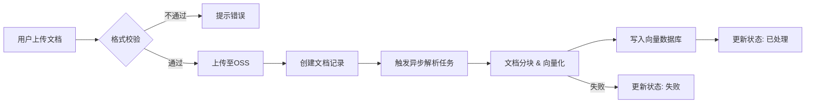

# 辰极智脑 - 文档管理需求说明书

## 一、修订记录

| 修订日期   | 修订内容                                           | 修订人员 | 审核人员 |
| :--------- | :------------------------------------------------- | :------- | :------- |
| 2025-12-03 | 辰极智脑文档管理功能初稿                           | 陈文静   | -        |
| 2025-12-04 | 根据交互逻辑、界面字段、界面操作的统一定义进行优化 | 陈文静   | -        |

---

## 二、需求背景与目标

### 2.1 编写目的

本文档旨在明确“辰极智脑”系统中“文档管理”模块的功能需求、交互逻辑及非功能性指标。该文档将作为UI设计、前端开发、后端开发及测试用例编写的依据。

### 2.2 产品背景

在企业知识管理和AI应用场景下，非结构化数据（文档）是核心资产。需要一个统一的文档管理平台来支撑知识库的构建与维护。文档管理功能作为辰极智脑的基础能力，为后续的 RAG（检索增强生成）、AI 问答、知识检索等功能提供底层数据支撑。

### 2.3 术语定义

* **RAG (Retrieval-Augmented Generation)**: 检索增强生成，一种结合了检索和生成能力的 AI 技术。
* **OSS (Object Storage Service)**: 对象存储服务，用于存储海量非结构化数据。
* **向量化 (Embedding)**: 将文本转换为向量数据的过程，用于计算机理解语义。

---

## 三、用户角色与场景

### 3.1 用户角色

| 角色               | 职责描述             | 权限范围                                                       |
| :----------------- | :------------------- | :------------------------------------------------------------- |
| **普通用户** | 知识的使用者和贡献者 | 上传文档、查看/下载自己上传的文档、查询知识库                  |
| **管理员**   | 系统的维护者         | 管理所有文档（增删改查）、管理标签体系、配置分类、监控构建任务 |

### 3.2 典型场景

1. **知识库初始化**: 管理员批量上传公司历史技术文档（PDF/Word），系统自动解析并构建索引。
2. **日常维护**: 员工上传最新的项目周报或需求文档，打上“项目A”标签，便于后续检索。
3. **文档清理**: 管理员定期清理“解析失败”或“已过期”的文档，释放存储空间。

---

## 四、业务流程

---

## 五、功能性需求

### 5.1 文档列表

#### 原型图

（请插入原型图）

#### 业务说明

* **数据加载与权限控制**

  1. **管理员**：进入页面时，默认加载系统中**所有文档**的第一页数据，并按“上传时间”降序排列。
  2. **普通用户**：进入页面时，默认**仅加载当前登录用户自己上传**的文档的第一页数据，并按“上传时间”降序排列。
  3. **分页加载**：列表支持分页，用户可切换页码或调整每页显示数量。所有翻页、排序、搜索、筛选操作都必须在当前用户的权限范围内进行。
* **统计卡片数据来源**

  1. **总文档数**：

     * **管理员**：统计数据库中所有状态的文档总数。
     * **普通用户**：仅统计当前用户上传的所有状态的文档总数。
  2. **处理中**：

     * **管理员**：统计数据库中状态为“处理中”的文档总数。
     * **普通用户**：仅统计当前用户上传的状态为“处理中”的文档总数。
  3. **总存储量**：

     * **管理员**：累加数据库中所有文档的“文件大小”字段值。
     * **普通用户**：仅累加当前用户上传的所有文档的“文件大小”字段值。
     * *该数值应格式化为最合适的单位（KB, MB, GB）。*
  4. **今日上传**：

     * **管理员**：统计数据库中“上传时间”为当天的文档总数。
     * **普通用户**：仅统计当前用户上传的且“上传时间”为当天的文档总数。
* **核心交互逻辑**

  1. **状态变更**：当文件被系统后台处理（如向量化）完成后，文档列表中的对应文件状态会由“处理中”自动更新为“已处理”或“失败”，此更新应实时或通过轮询反映到前端界面。
  2. **数据刷新**：用户执行上传、删除、批量操作成功后，列表及顶部的统计卡片数据应自动刷新，以反映最新状态。
  3. **组合查询**：搜索和筛选功能支持组合使用。例如，用户可以筛选出“技术文档”分类下，状态为“已处理”的，且文件名包含“AI”的文档。

#### 界面字段说明

| 字段名       | 字段类型     | 是否必填 | 说明                                                   |
| :----------- | :----------- | :------- | :----------------------------------------------------- |
| 文件名搜索   | 文本输入     | 否       | 用于输入文件名关键词进行模糊搜索。                     |
| 分类筛选     | 下拉选择     | 否       | 用于按技术文档、设计文档等分类筛选文件。               |
| 状态筛选     | 下拉多选     | 否       | 用于按上传中、处理完成、失败等状态筛选文件。           |
| 文件类型筛选 | 下拉多选     | 否       | 用于按PDF、DOCX等文件类型筛选文件。                    |
| 日期范围筛选 | 日期范围选择 | 否       | 用于按上传日期范围（如今日、本周）筛选文件。           |
| 标签筛选     | 下拉多选     | 否       | （高级筛选）用于选择一个或多个标签来筛选文件。         |
| 文件大小筛选 | 数字范围输入 | 否       | （高级筛选）用于输入文件大小的最小和最大值来筛选文件。 |

#### 界面操作说明

| 操作名称 | 操作说明                                                                               |
| :------- | :------------------------------------------------------------------------------------- |
| 查看     | 点击文件名或查看按钮，界面右侧将滑出该文件的详情侧边栏。                               |
| 下载     | 点击下载按钮，将触发浏览器下载该文件。                                                 |
| 删除     | 点击删除按钮，会弹出二次确认对话框，确认后将永久删除该文件及相关索引。                 |
| 批量选择 | 勾选列表项前的复选框，勾选后顶部将出现批量操作栏，可进行批量删除、分类、打标签和下载。 |

---

### 5.2 文档上传

#### 原型图

（请插入原型图）

#### 业务说明

* **文件归属**：用户上传文件成功后，系统记录该文件归属于当前登录用户。
* **状态流转**：文件成功上传至OSS并创建数据库记录后，其初始状态置为“处理中”，并触发异步解析任务。
* **上传反馈**：

  1. 上传成功后，系统自动关闭上传弹窗，并刷新文档列表，将新上传的文件（状态为“处理中”）展示在列表顶部。
  2. 若部分文件上传失败，弹窗关闭后应在界面右下角弹出Toast提示：“成功上传X个文件，Y个文件失败”，并提供查看失败详情的入口。
* **冲突处理**：

  1. 若用户上传了与自己拥有的文件同名的文件，系统会提示“文件名已存在，是否覆盖？”。选择“是”则会创建新版本的文件（或直接替换，根据产品策略决定），选择“否”则取消该文件的上传。
  2. 管理员上传文件若与系统中其他用户的文件同名，则直接上传，因为文件归属不同。
* **前置校验**：在文件加入待上传列表时，前端立即对文件格式和大小进行校验，不符合要求的文件将被标记为红色并禁止上传。

#### 界面字段说明

| 字段名   | 字段类型      | 是否必填 | 说明                                                                           |
| :------- | :------------ | :------- | :----------------------------------------------------------------------------- |
| 上传文件 | 文件选择/拖拽 | 是       | 用户必须选择或拖拽至少一个文件才能执行上传。支持的格式和大小详见非功能性需求。 |
| 文档分类 | 下拉选择      | 否       | 用户可以为本次上传的所有文件统一指定一个分类，默认为“未分类”。               |
| 添加标签 | 标签输入/多选 | 否       | 用户可以为本次上传的所有文件统一添加一个或多个标签。                           |

#### 界面操作说明

| 操作名称 | 操作说明                                                                       |
| :------- | :----------------------------------------------------------------------------- |
| 拖拽上传 | 将一个或多个文件拖拽到指定区域，文件会自动添加到待上传列表中。                 |
| 点击上传 | 点击上传区域或按钮，会弹出操作系统的文件选择窗口，用户可以选择一个或多个文件。 |
| 移除文件 | 在上传列表中，用户可以点击文件名旁边的移除按钮，将该文件从本次上传任务中移除。 |
| 确认上传 | 点击此按钮，开始将待上传列表中的所有有效文件上传至服务器。                     |
| 取消上传 | 在文件上传过程中，用户可以点击单个文件旁边的取消按钮，中止该文件的上传。       |
| 取消     | 点击此按钮，将关闭整个上传对话框，并清空待上传列表。                           |

---

### 5.3 文档详情

#### 原型图

（请插入原型图）

#### 业务说明

* **权限控制**：

  1. **管理员**：可以查看系统中任何文档的详情。
  2. **普通用户**：**只能**查看自己上传的文档的详情，尝试访问非自己上传的文档详情时，应提示“权限不足”。
* **数据展示**：详情页展示的所有信息（基本信息、业务属性、日志等）均来源于该文件的数据库记录。
* **实时保存**：当用户修改了“分类”、“标签”或“描述”信息后，鼠标焦点离开该输入框（onBlur事件）时，系统会自动执行保存操作，并给出“保存成功”的Toast提示。保存失败则提示具体原因。
* **并发控制**：若用户A正在查看详情，此时用户B（如管理员）修改了该文档的信息，用户A的详情页不会自动更新。但如果用户A此时也尝试修改并保存，系统应提示“文档已被他人修改，请刷新后重试”，防止数据覆盖。
* **重试机制**：对于状态为“失败”的文档，其详情页状态标签旁会显示一个【重试】按钮。用户点击后，系统会重新触发对该文档的异步解析任务，并将文档状态更新为“处理中”。

#### 界面字段说明

| 字段名 | 字段类型      | 是否必填 | 说明                                              |
| :----- | :------------ | :------- | :------------------------------------------------ |
| 分类   | 下拉选择      | 否       | 用户可在此修改文档的业务分类。                    |
| 标签   | 标签输入/多选 | 否       | 用户可在此增加、删除或修改文档的标签。            |
| 描述   | 文本域        | 否       | 用户可为文档添加或修改一段最多500字符的描述信息。 |

#### 界面操作说明

| 操作名称 | 操作说明                                                                                 |
| :------- | :--------------------------------------------------------------------------------------- |
| 重试解析 | 对于处理失败的文档，点击此按钮会触发系统重新进行解析和向量化处理。                       |
| 预览     | 对于支持的格式（如PDF, TXT, MD），点击此按钮会在新的浏览器标签页中打开文件内容进行预览。 |
| 下载     | 点击此按钮将触发浏览器下载当前文档的原始文件。                                           |
| 关闭     | 点击侧边栏的关闭图标或外部遮罩区域，将收起详情侧边栏。                                   |

---

### 5.4 批量操作

#### 原型图

（请插入原型图）

#### 业务说明

* **权限控制**：

  1. **管理员**：可以对列表中的**任意**文件进行批量操作。
  2. **普通用户**：**只能**对自己上传的文件进行批量操作。前端界面应禁止普通用户勾选非自己上传的文件（理论上普通用户也看不到）。后端接口在执行操作前，必须再次校验每一个文件的归属权限。若批量操作请求中包含无权限的文件ID，应拒绝整个请求并返回“权限不足”的错误。
* **操作触发**：当用户在文档列表中勾选至少一个文件后，页面顶部会自动浮现批量操作栏。操作栏会显示当前已勾选的文件数量。
* **删除逻辑**：执行批量删除操作并确认后，系统将**软删除**（标记为已删除状态）或**硬删除**（物理删除，并同步删除OSS文件和向量索引）所有选中的文件。操作完成后，文档列表及统计数据将自动刷新。
* **更新逻辑**：执行批量分类或批量标签操作并确认后，系统会为所有选中文件更新其数据库记录中的分类或标签字段。操作结果应实时反映在文档列表中。
* **下载逻辑**：执行批量下载时，系统会从OSS拉取所有选中文件的原始文件，在服务器端将它们打包成一个 .zip 压缩文件，打包完成后自动触发浏览器下载。此过程可能耗时较长，前端应有明确的“正在打包，请稍候...”的提示。

#### 界面字段说明

| 字段名   | 字段类型      | 是否必填 | 说明                                                                   |
| :------- | :------------ | :------- | :--------------------------------------------------------------------- |
| 目标分类 | 下拉选择      | 是       | 执行“批量分类”时，用户必须选择一个目标分类。                         |
| 标签动作 | 单选按钮      | 是       | 执行“批量标签”时，用户必须选择是“添加”、“移除”还是“替换”标签。 |
| 目标标签 | 标签输入/多选 | 是       | 执行“批量标签”时，用户必须提供一个或多个要操作的标签。               |

#### 界面操作说明

| 操作名称 | 操作说明                                                                                                 |
| :------- | :------------------------------------------------------------------------------------------------------- |
| 批量删除 | 点击后弹出确认对话框，其中包含警告信息和待删除文件列表，确认后执行删除。                                 |
| 批量分类 | 点击后弹出分类选择对话框，用户选择目标分类并确认后，为所有选中文件更新分类。                             |
| 批量标签 | 点击后弹出标签操作对话框，用户选择操作动作（添加/移除/替换）和目标标签并确认后，为所有选中文件执行操作。 |
| 批量下载 | 点击后系统开始打包文件，并显示打包进度，完成后自动触发下载。                                             |

---

### 5.5 标签管理

#### 原型图

（请插入原型图）

#### 业务说明

* **功能权限**：【标签管理】功能入口（如页面右上角的按钮）**仅对管理员角色可见**。普通用户无权访问标签管理功能。
* **数据全局性**：标签是系统全局的，不归属于任何用户。管理员创建、编辑、删除的标签对所有用户可见并可用（例如，在上传和详情编辑时）。
* **冲突处理**：当管理员尝试创建一个已存在的标签名时（不区分大小写），系统会提示“标签名称已存在”，创建失败。
* **删除影响**：当管理员删除一个正在被文件使用的标签时，系统会弹出二次确认对话框，明确告知“标签'XXX'正被Y个文件使用，删除后这些文件将失去该标签，确认删除？”。用户确认后，系统会从所有使用该标签的文档记录中移除此标签。
* **预设标签**：系统可以预设一些常用标签（如：重要、紧急）。这些预设标签不可被管理员编辑或删除，在UI上其对应的编辑/删除按钮应为置灰不可用状态。

#### 界面字段说明

| 字段名   | 字段类型 | 是否必填 | 说明                                                               |
| :------- | :------- | :------- | :----------------------------------------------------------------- |
| 标签名称 | 文本输入 | 是       | 新建或编辑标签时，必须输入标签名称，长度不超过20字符，且不能重复。 |

#### 界面操作说明

| 操作名称 | 操作说明                                                                   |
| :------- | :------------------------------------------------------------------------- |
| 新建标签 | 点击后出现输入框，用户输入标签名称并确认后，在标签列表中新增一个标签。     |
| 编辑标签 | 点击标签旁的编辑图标，标签名称变为可编辑状态，用户修改后自动保存。         |
| 删除标签 | 点击标签旁的删除图标，弹出确认对话框，确认后将永久删除该标签。             |
| 搜索标签 | 在顶部的搜索框输入关键词，标签列表会实时过滤，只显示名称包含关键词的标签。 |

---

## 六、非功能性需求

### 6.1 文件限制

| 限制项           | 限制值               |
| :--------------- | :------------------- |
| 单文件大小限制   | 100 MB               |
| 单次批量操作最多 | 100个文件            |
| 文件名长度限制   | 255字节（UTF-8编码） |
| 上传超时时间     | 60秒                 |

### 6.2 支持的文件格式

| 类型   | 格式                                                                     |
| :----- | :----------------------------------------------------------------------- |
| 文档类 | pdf, txt, md, doc, docx, ppt, pptx, xls, xlsx, html, htm, csv, json, xml |
| 图片类 | png, jpg, jpeg, gif, bmp, tif, tiff, webp                                |

### 6.3 错误提示

| 错误场景         | 提示内容                                    |
| :--------------- | :------------------------------------------ |
| 文件不存在       | 文件不存在或已被删除，请刷新页面            |
| 文件过大         | 文件大小超过限制（最大100MB），请压缩后重试 |
| 不支持的文件类型 | 不支持该文件格式，请上传支持的格式          |
| 批量操作超限     | 单次批量操作最多支持100个文件               |
| 解析服务超时     | 文档解析超时，请稍后点击重试                |
| 权限不足         | 您没有权限执行此操作                        |

### 6.4 性能与安全性

| 类别                 | 要求描述                                                                             |
| :------------------- | :----------------------------------------------------------------------------------- |
| **性能要求**   | 列表加载时间 < 1秒（1万条数据内）；内网上传速度 < 10秒（100MB）；支持20人并发上传。  |
| **安全性要求** | 只有上传者和管理员可删除文档；后端必须校验文件魔数（Magic Number）防止恶意文件上传。 |
| **可靠性要求** | 解析任务失败后自动重试3次；大文件上传建议支持断点续传。                              |
